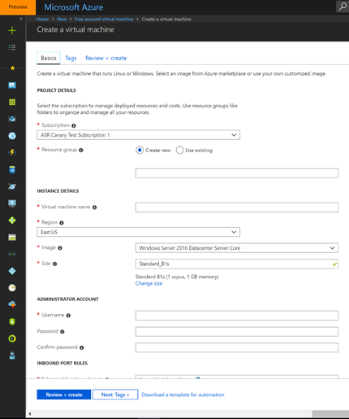
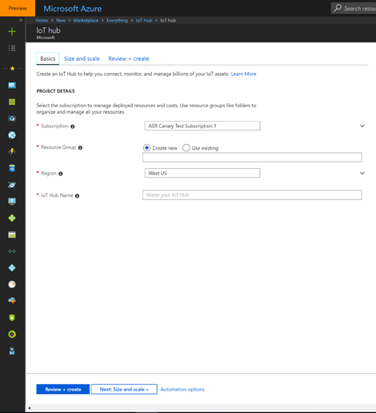
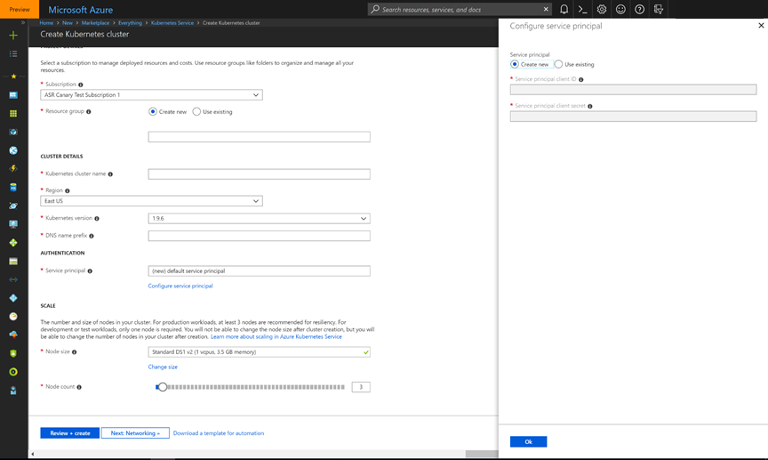
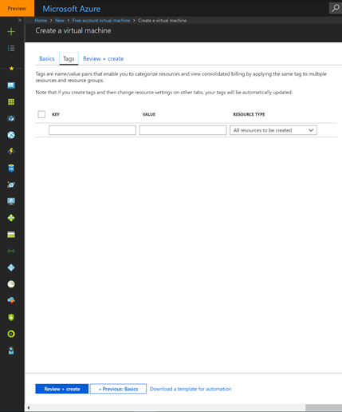
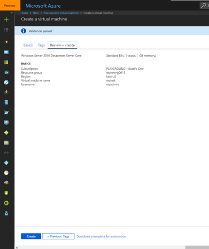
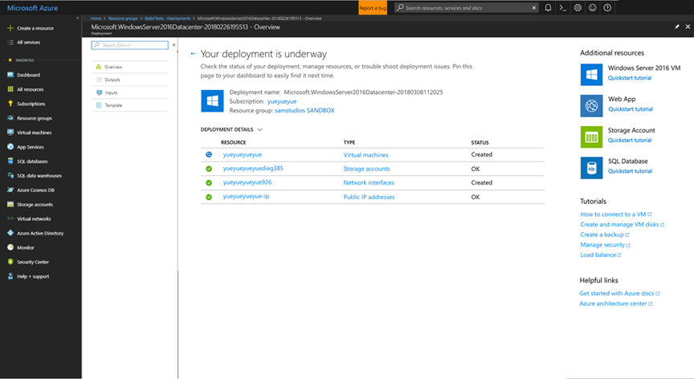

<a name="overview"></a>
## Overview

The Resource Create pattern enables a quick and straightforward way to create Azure resources. It is also known as the Fullscreen create experience. The experience uses tabs for easy navigation, fills the screen without horizontal scrolling.  The first tab should contain all the required fields so that a user can simply fill the visible fields to create the resource. Subsequent tabs allow a user to fill in optional fields or customize the resource. The last tab, which is optional, enables the user to review all screen inputs to determine whether they have all been validated against Azure previous to creating the resource.

<a name="resource-create-blade"></a>
## Resource create blade

Some examples are as follows.

* The Free account virtual machine for the RC portal is located at   [http://aka.ms/portalfx/portalfx/freeaccountvm](http://aka.ms/portalfx/freeaccountvm)

* The IoT hub for the RC portal is located at [http://aka.ms/portalfx/iothubs](http://aka.ms/portalfx/iothub)

 * The Kubernetes Service is located at [http://aka.ms/portalfx/kubernetes](http://aka.ms/portalfx/kubernetes)

<a name="resource-create-blade-resource-create-behaviors"></a>
### Resource create behaviors

The Resource Create is a fullscreen experience. 

The key items that are initially displayed are the tabs.  Information on the tabs is organized in a manner that separates required fields from optional fields. These tabs do not map to tabs on an existing create experiences, because all required fields for the experience should be located on the first tab.

You can create a resource by navigating through the tabs, from left to right, and entering the appropriate details for the new resource.  You can also navigate the same journey by using the buttons in the page footer. 


* Basics tab

    This is the first tab, and it contains all required fields. A first tab  that contains all required fields allows the user to quickly create your resource. The  following image that describes the Basic Create experience.

    

    The following is an image of a resource create experience for an IoT hub resource.

    

    The IoT create experience customized the tabs to be more meaningful for this resource.   The tabs include commands that open context panes for additional detail, as in the following image.
      
    


* Optional tabs

    These are other tabs that are used to organize optional settings on the resource, as in the following image.

  
    

* Review + create tab
 
    This is the final tab that lets the user review the settings across all tabs, and validate the inputs against Azure before submitting the form to Azure, as in the following image.
      
    

 
* Footer navigation
 
    This control contains two to three buttons used for navigating between tabs, as well as the Computed Time of Arrival (CTA) for creating the resource.  You can add controls or links to the footer that are relevant to the creation of your resource.  For example, the IoT resource create experience includes the option of downloading an automation template.

<a name="resource-create-blade-post-create-blade"></a>
### Post create blade

When the options on the resource you intend to create have been entered on all the screens and context panes, the "Create" button on the third tab is used to generate the resource.  The following image depicts the deployment of the new resource on the Post-create blade.
    


The Post Create blade displays realtime deployment status and improves troubleshooting by using an improved error display.  You can also include information about additional resources to help the user learn more about the resource being created, or related Azure resources.

<a name="creating-a-resource-or-resource-type"></a>
## Creating a resource or resource type

You can customize the tabs to help the user specify the resource. Some guidelines for customization are included in this section.

* Explanatory text 

    Add one or two descriptive sentences at the top of each tab to provide context that is  highly visible. The following is an example of how to structure the text.
    
    ```txt
        Configure <feature> to allow the resource to perform <action>.
    ```
 
* Input field containers

    When creating a form or context pane that includes several fields that pertain to a specific subject, group the fields together with a header that presents a clear indication of what the user should provide to create the resource. There can be several groups of fields on a single context pane.
 
* Sub create context pane

    Context panes are used for sub-creates within the create flow. The sub-create allows users to create resources that are required components of the main resource that is being created, without losing the overall context. 
 
* Info balloons 

    If there are input fields that may not be immediately familiar to your customers, include an info balloon that displays more information. 

**NOTE**: If the screen resolution is less than 700px, set left aligned = false to realign the page content for better visibility.

For more information about designing a Resource Create experience, see [top-extensions-resource-browse.md#design-tools-and-toolkits](top-extensions-resource-browse.md#design-tools-and-toolkits).