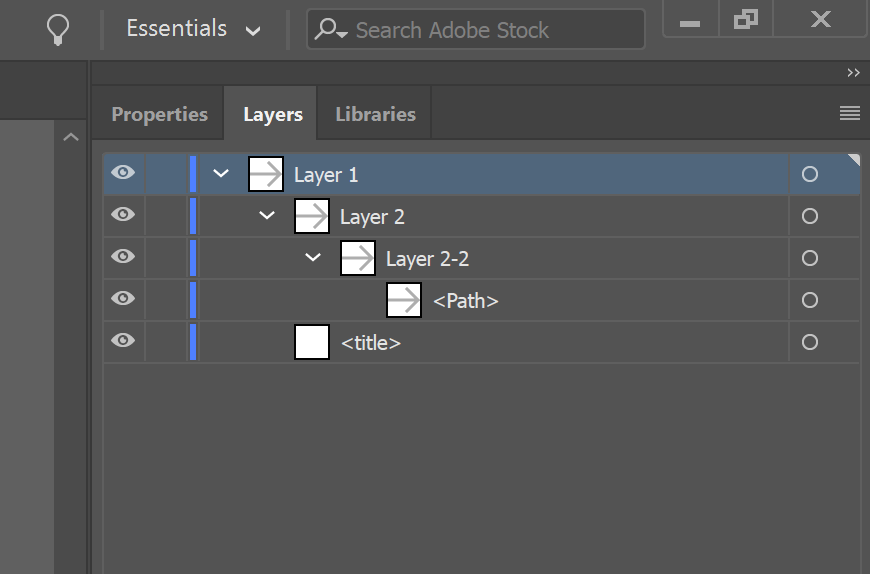

# Icons
Icons are used in commands, resource menus, blades, titles and portal navigation. The portal places some special requirements on the types of icons you can use. All icons are required to be SVG files so that icons will scale on high resolution devices, and for automatic theming.
In many cases, you will not need to provide your own icons, as the SDK framework includes a large library of icons for common uses.

* Use flat icons for commands
* Use polychromatic icons for resource menu, blades, titles and portal navigation.

## How to prepare icons created in Illustrator
This page covers how to properly export an icon that you've created in Illustrator to use in the Azure portal. Illustrator provides several ways to save a file as an SVG but this is the recommended method.
<!--TODO Claire to get link to palette -->
1. Make sure the colors you used are in the approved color palette
2. Save the icon by going to File > Save As...
3. In the Save As window, change the 'Save as type:'  to .SVG (*.SVG) in the dropdown
4. Hit 'Save.' This will invoke the SVG Options window
5. Make sure your settings in the SVG Options window are as follows, then hit OK

### Do
 - Put all artwork onto a single layer, like this

### Don't
 - Keep artwork on multiple layers, like this
 
 

## Design guidelines
* Design guidelines [top-design.md](top-design.md)

# For developers 
Developers can use the following information to get started implementing this pattern

## Related documents

* Icons [portalfx-icons.md](portalfx-icons.md)
* Built-in icons [portalfix-icons-builtin.md](portalfx-icons-builtin.md)
* Creating icons [portalfx-icons-creation.md](portalfx-icons-creation.md)
