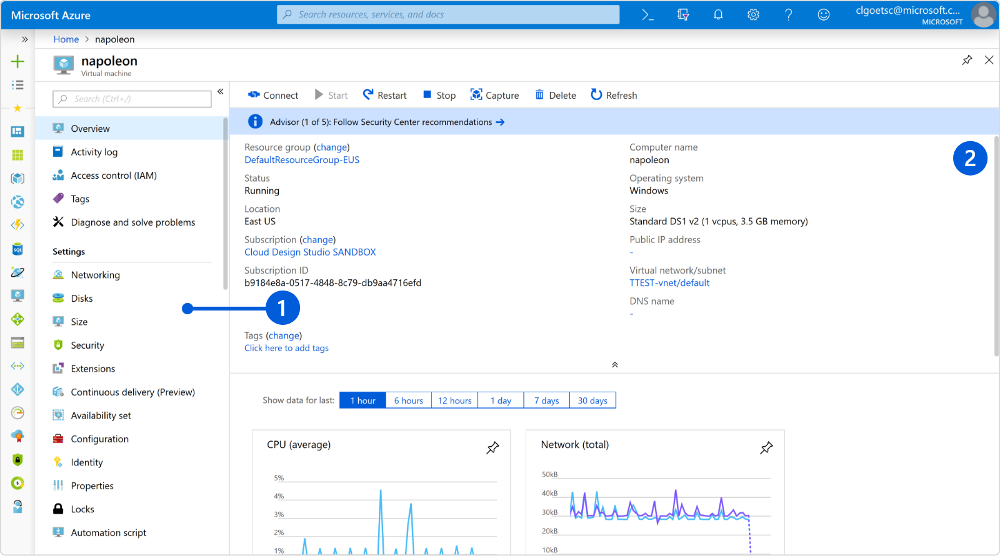
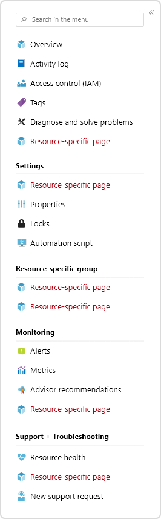

# Resource Manage 
The Resource Manage pattern provides the configuration and management of a single Azure resource.

# Problem
Users manage many different types of Azure resources. For settings that are common across resources, users expect a common interaction. For settings that are unique to a resource, users need a way to easily find those settings.

# Solution
The Resource Manage pattern is used to configure and manage a single Azure resource by using a resource menu to navigate the resource blades. The resource manage page is typically opened from the resource browse page, when the user needs to see more details or make a change to a specific resource. The resource manage page can also be opened from related resources that link to it.

## Also known as 
-   Resource blade 
-   Resource detail
-   Resource menu  

# Examples
---------

## Example images

## Example uses
These Azure resources are good examples of this design pattern 

-   Redis cache
-   [Virtual machines](https://rc.portal.azure.com/#blade/HubsExtension/Resources/resourceType/Microsoft.Compute%2FVirtualMachines)

# Use when 
Managing a single azure resource.

## Anatomy  
The resource manage pattern is a full screen experience composed of a resource menu and corresponding resource blades. Settings that are common across resources have a standard menu item and menu location so that users can easily find them.
<!-- TODO - get updated resource manage anatomy image -->

A resource manage experience usually contains:

1. Resource menu with common and specific items to manage all aspects of this resource
2. Resource pages opened from the menu items, commands or links

## Behavior 
When a resource is opened in azure the resource menu is loaded and the Overview page for the resource is displayed.  The user can then select other menu items as needed.

### Resource menu
The resource menu offers a way to navigate to all pages related to the resource. The navigation includes pages that are common to all resources throughout the portal. Your resource will get those "for free," although some common pages require onboarding by the resource provider. You can add as many pages to your resource as you need  Refer to the table below to make sure each item is grouped properly. Learn more [Resource Menu](top-blades-resourcemenublade.md)

<table style="width:800px; border-style:none; cellpadding=10px">
<tr>
<td width="30%" align=center valign=top>
<!-- TODO get updated screenshot that matches new fluent styling -->

</td>
<td valign=top>
Resource menu parts:
  
Top items: items common to all resources
<ul>
<li>Overview</li>
<li>Activity logs</li>
<li>Access control (IAM)</li>
<li>Tags</li>
<li>Diagnose and solve problems</li>
</ul>
 
SETTINGS: a grouping of the menu that enables configuration of resource settings
<ul>
<li><i>Resource-specific settings items</i></li>
<li>Properties</li>
<li>Locks</li>
<li>Automation script</li>
</ul>
 
<i>Resource-specific groups and items</i>
  
MONITORING: a grouping of the menu that enables monitoring the resource
<ul>
<li>Alerts</li>
<li>Metrics</li>
<li>Diagnostic settings</li>
<li>Logs</li>
<li><i>Resource-specific monitoring items</i></li>
</ul>
 
SUPPORT + TROUBLESHOOTING: a grouping of the menu that enables navigation to support and troubleshooting info
<ul>
<li>Resource health</li>
<li><i>Resource-specific support + troubleshooting items</i></li>
<li>Create support request</li>
<ul>
</td>
</tr>
</table>

### Resource pages   
Each menu item opens a page that allows the user to drill deeper for more information. Monitoring 
pages requires additional onboarding to Geneva Resource health requires additional onboarding by RP. 

### Overview page
The overview page is the home page for a resource. It displays key information and actions for the resource.  The overview page should contain a `toolbar`, `essentials panel`, and `content area`.

#### Toolbar 
Toolbar commands should open context panes instead of narrow blades to avoid horizontal scrolling. The resource toolbar should contain commands common to all resources
* `Delete` - delete the current resource
* `Move` - a dropdown menu to move the current resource to a different **resource group** or **subscription**
* `Refresh` - refresh the overview page
The resource toolbar should also contain resource-specific commands for easy access.
Learn more [Toolbar](portalfx-controls-toolbar.md), [Context pane](top-extensions-context-panes.md)

#### Essentials panel
The essentials panel surfaces key properties that are common for all Azure resources and important resource specific properties. User feedback has
shown that they rely heavily on the essentials panel for looking up information.  Properties can contain links, and can open blades containing related resources (for example, resource group, subscription, hosting plan, etc). The links can also point to external sites. 

The Essentials sections is conceptually divided in two well know parts:

**Ordering guidelines**

Here are the field ordering guidelines.  

**Common resource properties - Left column**
* Resource group
* Status
* Location
* Subscription name (as a link to a child blade)
* Subscription ID

**Resource-specific properties - Right column**
* Up to 5 domain-specific fields.
* Labels for fields should be limited a maximum length of 150px.

**Tags** 
* Display and manage the tags assigned to this resource
* Enabled with control option

Learn more [portalfx-extensions-essentials.md](./portalfx-extensions-essentials.md)

#### Content area
Display guiding content and key information about the resource
* *Must* meet the performance bar – the overview page is the most viewed blade for your resource   
* Content to guide the user to get the most from the resource  
* Resource properties to indicate important resource configuration  
* Resource performance metric graphs to indicate whether resource is functioning properly   

## Do 

* Open context blades for user input and short summaries 

* Ensure you have efficient APIs to get data for your overview page  

* Do leverage a status bar for resource level or page level messaging (error, warning, info, upsell)   

## Don't 

* Don’t create resource-specific menu groups that have only one menu item   

* Don’t put so much information on your resource overview page that it fails the performance bar. You'll end up removing it to meet the bar.   

* Don’t build your overview page as a PDL blade   

# Related design patterns
* Resource Create [design-patterns-resource-create.md](design-patterns-resource-create.md)
* Resource Browse [design-patterns-resource-browse.md](design-patterns-resource-browse.md)
* Design patterns [top-design.md](top-design.md)

# Research and usability

# Telemetry

# For developers 
Developers can use the following information to get started implementing this pattern

## Tips and tricks 
* Use the ResourceMenu SDK building block 

* Opt in to ResourceMenu using the AssetType `UseResourceMenu="true"` option
    * Assign keywords to your Resource Menu items to help the user find items   
    * Enable the recommended flags on your resource menu
        * `enableSupportTroubleshootV2`
        * `enableProperties`
        * `enableAlerts`
        * `enableMetrics`
        * `enableLogs`
        * `enableDiagnostics`
        * `enableResourceHealth`
    * Make your resource menu static to help meet the performance bar 

* For you overview page
    * Build your overview page as a template blade   
    * To display tags in the Essentials Panel, add this line to the options object
passed to the essentials control:  `includeTags:true`
    * Make sure you have efficient APIs for overview data 
    * Include standard Overview page actions - `Move`, `Delete` and `Refresh`

* Make sure your RP has onboarded to Geneva for metrics and logs so you can
enable the monitoring menu items 

* Make sure your RP has onboarded to health services so you can enable the
diagnose/troubleshooting and resource health menu items 

## Related documentation

* Resource Menu [top-blades-resourcemenublade.md](./top-blades-resourcemenublade.md)
* Essentials [portalfx-controls-essentials.md](./portalfx-controls-essentials.md)
* Toolbar control [portalfx-controls-toolbar.md](portalfx-controls-toolbar.md) 
* Context Pane [top-extensions-context-panes.md](top-extensions-context-panes.md)
* Properties page [portalfx-blades-properties.md](portalfx-blades-properties.md)
