The AAD Onboarding Website is located at [https://aadonboardingsite.cloudapp.net/RegisterApp](https://aadonboardingsite.cloudapp.net/RegisterApp).

Follow the instructions on the website to register your app.

  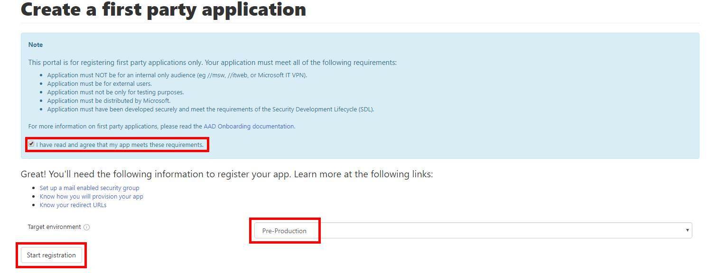

  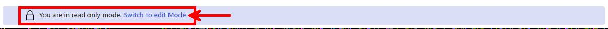

  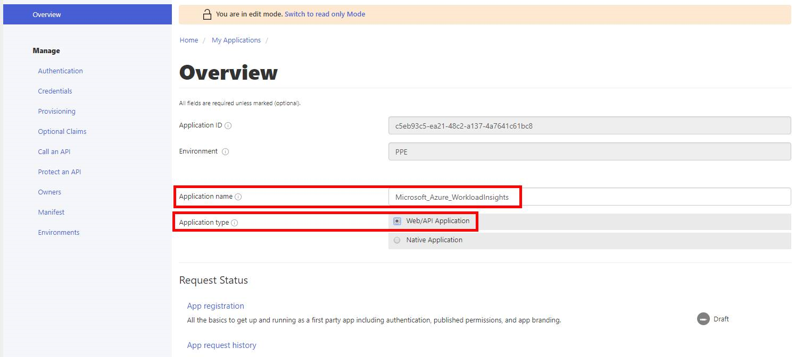

**NOTE**: If you need MSA users without Azure accounts to authenticate, Select "Enable" for the  `MSA Passthrough` option on the following screen.

  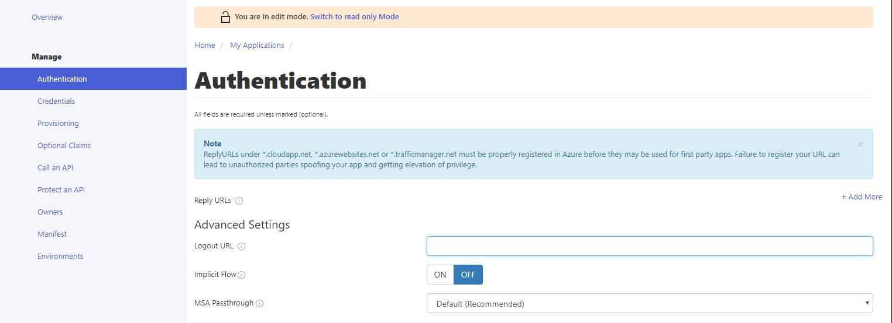

  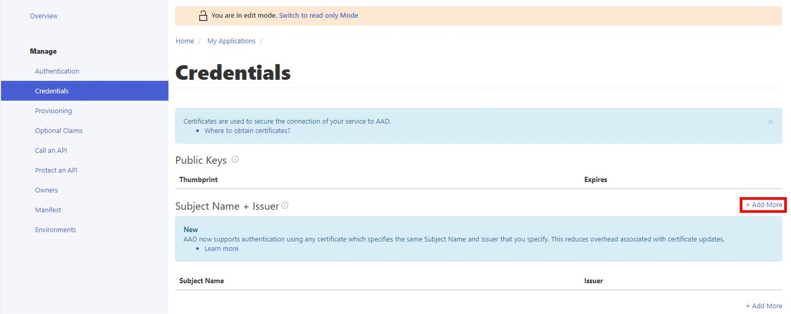

  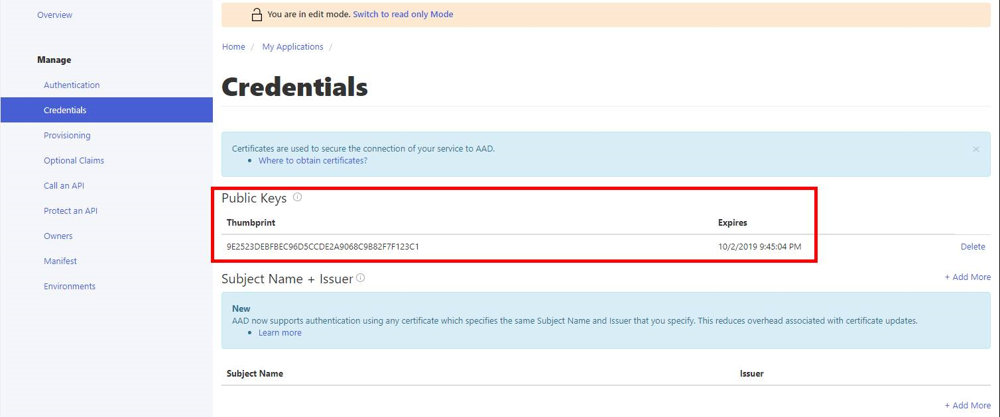

  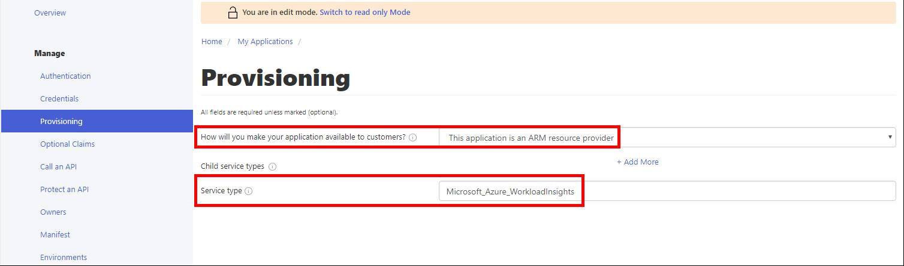

  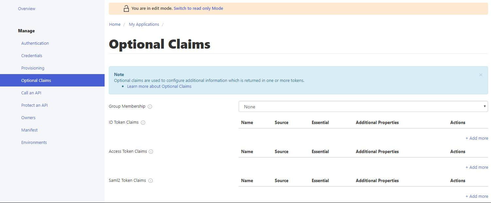

  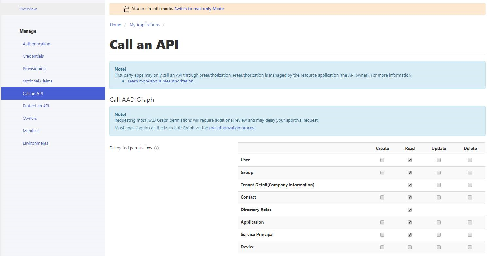

  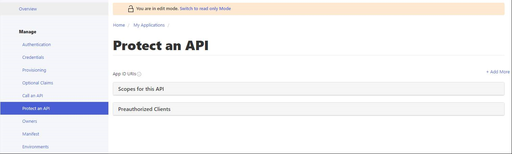

  

  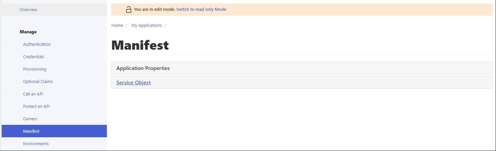

  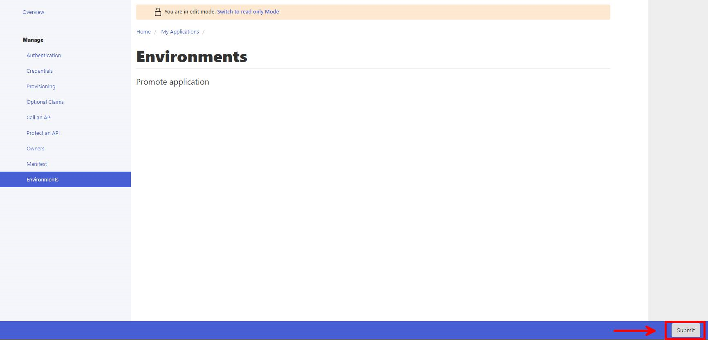
  
  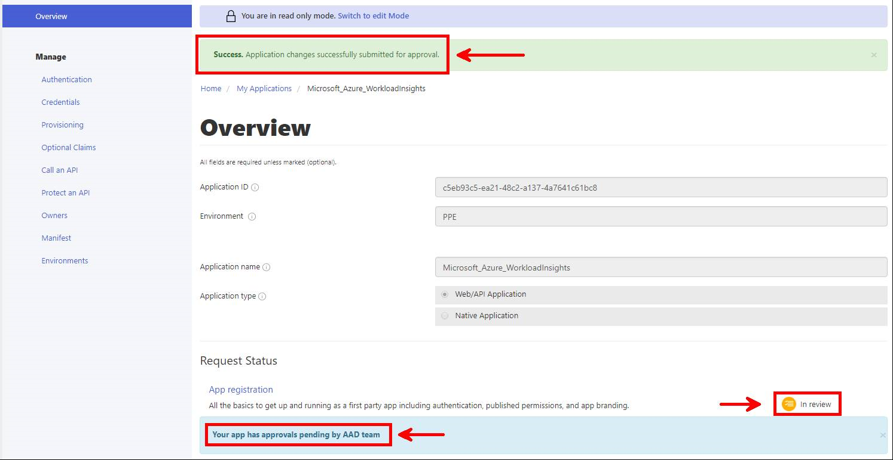
