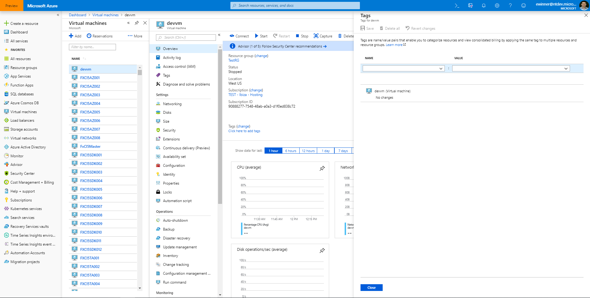

# Forms
Forms are the manner in which we gather and validate user input.

# Context
Users enter information to manage Azure resources.

# Problem
Users need to input information to create, configure and manage resources.  Users also file support tickets and provide feedback by entering information in the portal.

# Solution
The portal offers several variations of forms with consistent field and form validation to ensure users can easily input information and understand whether that info is valid.  The form variations are `dialogs`, `context panes`, `full screen blades` and `wizards`.  In all cases, the field layout and validation are consistent.  Well designed input forms enable users to increase the speed and accuracy of input and lead to successful form completion.

## Also known as

# Examples

## Example images

### Dialog

### Context Pane - narrow

### Context Pane - wide

### Full screen blade

### Wizard

## Example uses
* Stopping a VM - Dialog 
* Tagging a VM - Context Pane
* Moving a VM to a different resource group - Full screen blade
* Creating a VM - Wizard [Free account virtual machine](https://rc.portal.azure.com/#create/microsoft.freeaccountvirtualmachine)

# Use when
Choose among these available options when designing experiences for the user to enter information.

* `Dialogs` are used for very simple input/acknowledgment and appear next to the user click target
* `Context panes` are used when more space is needed and the input form does not need to invoke any child blades.  Context panes appear on the rightside of the screen, vary in width and float over other content.
* `Full screen blades` are used when the input form needs the space or will invoke a child blade
* `Wizard` is a type of full screen blade with tabs across the top and is used to guide a user as they provide input when creating azure resources

## Anatomy
<!-- TODO get anatomy for dialog and context pane Use common numbers for elements -->

A form can contain:
1. Labels and corresponding input fields
2. Command buttons or another call to action
3. Error messaging
4. Field and Form validation

## Behavior
As the user enters information, field content is validated.  Upon form submission, the entire form is validated.

### Validation

#### Placeholder text
Include placeholder text can be formatted in two ways:
1. As an instruction

2. As an example of valid input format

#### Field validation
Don’t make users guess password requirements. Instead, include the password validation tool in your experience.

#### Error messaging
Provide highly visible and specific error messages.

### Control recommendations
#### Use radio buttons instead of toggles
The blue and white toggle used in the portal today has tested poorly among users because it's unclear which option is selected, especially if the choice is between 2 options.

The current guidance is to use radio buttons in favor of the toggle.

### Command button recommendations
* Buttons are at the bottom of the page in a non-scrollable docked area
* Use a single `Close` button if experience is informational only
* Use `Yes` and `No` buttons for destructive actions and include a confirmation question in the dialog - "Delete this VM?"
* Use the "action name", like `Move`, `Save`, `Attach`, `Add`, for the submit button and `Cancel` as the button to close the dialog
* Use `Ok` and `Cancel` as a last resort if a better action name is not apparent

<!-- TODO Should the "submit" buttons for forms always be active, so that user can get form validation -->
<!-- TODO Edit columns uses `Apply` and `Reset`, no close button -->

#### Dialog command buttons
Follow the button recommendations above
<!-- TODO Should clicking away from dialog cause it to close?  It does for Stop/Delete VM (Yes, No) but not the Attach/Detach nic example -->

#### Context pane command buttons
* Use buttons at the bottom of the page, follow button recommendations above
* Don't use a toolbar at the top of the page - example Tag resource
    * If context pane contains a grid, attach grid actions to the grid with a grid-level toolbar

#### Fullscreen blade form command buttons
* Use buttons at the bottom of the page, follow button recommendations above
* Use a toolbar at the top of the page only if page represents a more fully featured management experience - VM > Alerts > Manage alert rules
    * All buttons go in the toolbar using the naming conventions above
    * No `Close` button, the blade has an `X` in the upper right corner to close it

#### Fullscreen blade form opened from resource menu command buttons
* Use a toolbar at the top of the page when the form is opened from a resource menu - VM > Diagnostics settings
* All actions go in the toolbar using the naming conventions above
* No `Close` button, the blade has an `X` in the upper right corner to close it

#### Create wizard command buttons - see the [resource create pattern](top-designpatterns-resource-create.md) for details

## Do
-   Use inline labels and fields for full screen pages and stacked labels and fields for narrow blades

-   Mark required fields with a red asterisk * to distinguish them from optional fields

-   Include info bubbles if there are input fields that may not be immediately familiar

-   Left align all the of the input fields in a column. Jagged edges are difficult to skim

-   Visually group related labels and fields. [Labels should be close to the fields](https://www.nngroup.com/articles/form-design-white-space/) they describe (immediately above the field for context panes or next to the field for long forms). Avoid ambiguous spacing where labels are equidistant from multiple fields.

## Don't 
-   Don't use the toggle picker when a property has two options. (See above 'Toggles vs radio buttons')

-   Don't phrase labels as questions. Keep labels short and sweet.

-   Don't include fields that stretch across the full width of the page.

-   Avoid buttons for clearing a form. The risk of accidental deletion outweighs the unlikely need to start over.

# Related design patterns
* Full screen [top-designpatterns-page-fullscreen.md](top-designpatterns-page-fullscreen.md)
* Resource Create [top-designpatterns-resource-create.md](top-designpatterns-resource-create.md)
* Design patterns readme [portalfx-designpatterns-readme.md](portalfx-designpatterns-readme.md)

# Research and usability

# Telemetry

# For developers
Developers can use the following information to get started implementing this pattern

## Tips and tricks

## Related documentation
* Dialog [top-extensions-dialogs.md](top-extensions-dialogs.md)
* Context Pane [top-extensions-context-panes.md](top-extensions-context-panes.md)
* Forms [top-extensions-forms.md](top-extensions-forms.md)
* Forms [portalfx-forms.md](portalfx-forms.md)
