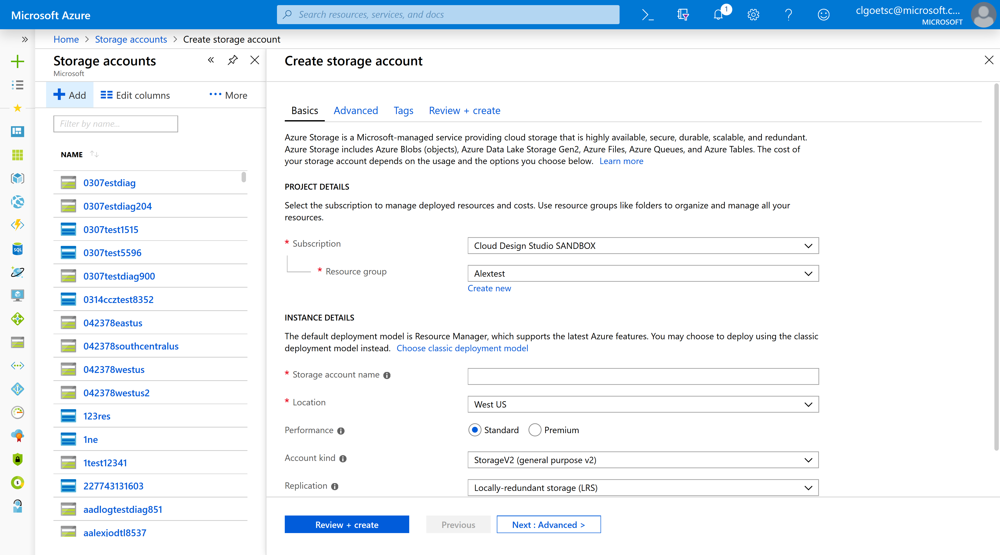

# Forms
Forms are the manner in which we gather and validate user input.

# Context
Users input information when managing Azure resources.

# Problem
Users input information to create, deploy and configure resources.  Users also file support tickets and provide feedback by entering information in the portal.

# Solution
Well designed input forms enable users to increase the speed and accuracy of input and lead to successful form completion.

## Also known as

# Examples

## Example images
<!-- TODO get example images of dialogs and context panes -->

## Example uses
* Stopping a VM - Dialog 
* Tagging a resource - Context Pane
* Creating a VM - Wizard [Free account virtual machine](https://rc.portal.azure.com/#create/microsoft.freeaccountvirtualmachine)

# Use when
User needs to input information

## Anatomy
<!-- TODO get anatomy for dialog and context pane Use common numbers for elements -->

A form can contain:
1. Labels and corresponding input fields
2. 'Save' and 'Discard' commands, 'Ok' and 'Cancel,' or another call to action
3. Error messaging
4. Field and Form validation

## Behavior

**Placeholder text**
Include placeholder text can be formatted in two ways:
1. As instruction

2. As an example

**Form validation**
Don’t make users guess password requirements. Instead, include the password validation tool in your experience.

**Toggles vs radio buttons**
The blue and white toggle used in the portal today has tested poorly among users because it's unclear which option is selected.

The current guidance is to use radio buttons in favor of the toggle.

**Error messaging**
Provide highly visible and specific error messages.

## Do
-   Use inline labels and fields for full screen pages and stacked labels and fields for narrow blades

-   Mark required fields with a red asterisk * to distinguish them from optional fields

-   Include info bubbles if there are input fields that may not be immediately familiar

-   Left align all the of the input fields in a column. Jagged edges are difficult to skim

-   Visually group related labels and fields. [Labels should be close to the fields](https://www.nngroup.com/articles/form-design-white-space/) they describe (immediately above the field for context panes or next to the field for long forms). Avoid ambiguous spacing where labels are equidistant from multiple fields.

## Don't 
-   Don't use the toggle picker when a property has two options. (See above 'Toggles vs radio buttons')

-   Don't phrase labels as questions. Keep labels short and sweet.

-   Don't include fields that stretch across the full width of the page.

-   Avoid buttons for clearing a form. The risk of accidental deletion outweighs the unlikely need to start over.

# Related design patterns
* Full screen [top-designpatterns-page-fullscreen.md](top-designpatterns-page-fullscreen.md)
* Resource Create [top-designpatterns-resource-create.md](top-designpatterns-resource-create.md)
* Design patterns readme [portalfx-designpatterns-readme.md](portalfx-designpatterns-readme.md)

# Research and usability

# Telemetry

# For developers

## Tips and tricks

## Related documentation
* Context Pane [top-extensions-context-panes.md](top-extensions-context-panes.md)
* Dialog [top-extensions-dialogs.md](top-extensions-dialogs.md)
* Forms [top-extensions-forms.md](top-extensions-forms.md)
* Forms [portalfx-forms.md](portalfx-forms.md)
