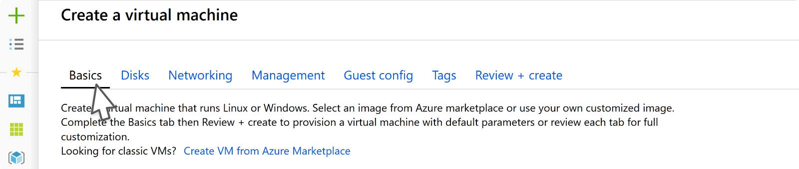

# Resource Create 
The resource create pattern allows for the creation of Azure resources leveraging the full screen create pattern.

# Context
Users need to create Azure resources 

# Problem
Creating a resource in Azure can vary from a simple form with a few required fields to a complex experience with many fields, concepts and related resources.

# Solution
The resource create pattern enables quick configuration of a new resource using minimal parameters. The experience uses discoverable tabs to separate related configuration steps and guide the user who wants to do more complex configuration during the create process.

## Also known as 

- Full screen create
- Tabbed create  

# Examples 
---------

## Example image

## Example uses
These Azure resources are good examples of this design pattern 

* [Free account virtual machine](https://rc.portal.azure.com/#create/microsoft.freeaccountvirtualmachine)
* [IoT hub](https://rc.portal.azure.com/#create/Microsoft.IotHub)
* [Kubernetes service](https://rc.portal.azure.com/#create/microsoft.aks)

# Use when
Creating a resource in Azure

## Anatomy  

A resource create experience usually contains:
1. Tabbed pages
2. Input fields
3. Sub create within a context menu
4. Footer navigation
5. Post create page

## Behavior 

### Tabs
Tabs help to group sections of the create experience into manageable categories. Tabs also separate required fields from optional fieldsfor faster configuration. 

-   **Basics**: The first tab contains fields required for creating the resource.

-   **Optional tabs**: Additional tabs are used to organize optional settings specific to your resource.  Tab naming recommendations

-   **Tags**: This tab allows users to give tags to the resource using key/value pairs.

-   **Review + create**: The final tab summarizes the settings across all tabs and validates the inputs against Azure before creating the resource.

### Explanatory text 
Adding one or two descriptive sentences at the top of each tab gives the user content at a highly visible part of the page. Here’s an example of how you can structure your text:

Configure \<this feature\> to enable your resource to perform \<this action\>. Learn more

### Grouped input fields
When creating a form that includes several fields pertaining to a certain subject, you can group them with a header that gives the user a clear indication of what they’re being asked for. You can also add explanatory text just below the group header if the task may not be immediately clear to the user.

### Sub create in a context pane
Context panes can be used for sub creates within the create flow. The sub create allows users to configure services or to create resources that are related to the main resource that's being created, without losing the overall context.

### Info balloons
If you have input fields that may not be immediately familiar to your customers, include an info balloon that gives them more information.

### Footer navigation
The footer nav contains the call to action (CTA) for creating the resource, as well as two buttons used for navigating between tabs. If your resource supports created templates, you can include an affordance for that in the footer nav.

## Post create
The post create page provides realtime deployment status, help with troubleshooting, and improved error display. Best practice is to include additional information here to help the user learn more about the resource being created, as well as related Azure resources.

**TODO** - screen shot and anatomy of post-create

## Do 
-   Do put all the required fields on the first tab so the user has the option to quickly create your resource

 - Include info bubbles if there are input fields that may not be
   immediately familiar to your customers

## Don't 
-   When moving your resource to full screen, don’t just map your existing create experience to separate tabs.

-   Don't include lengthy and unclear explanatory text. It should be used to clarify and set expectations in a few short sentences

# Related design patterns

-   Full screen
    [top-designpatterns-page-fullscreen.md](top-designpatterns--page-fullscreen.md)

-   Resource Browse
    [top-designpatterns-resource-browse.md](top-designpatterns-resource-browse.md)

-   Resource Manage
    [top-designpatterns-resource-manage.md](top-designpatterns-resource-manage.md)

# Research and usability 
Coming soon

# Telemetry
Coming soon

# For developers 

## Tips and tricks 

-   Use the ResourceMenu blade to get started building your resource manage
    experience
-   Screen resolution - If screen resolution is less than 700px, set left aligned = false.

## Related documentation

-   Resource Create
    [top-extensions-create.md](./top-extensions-create.md)

