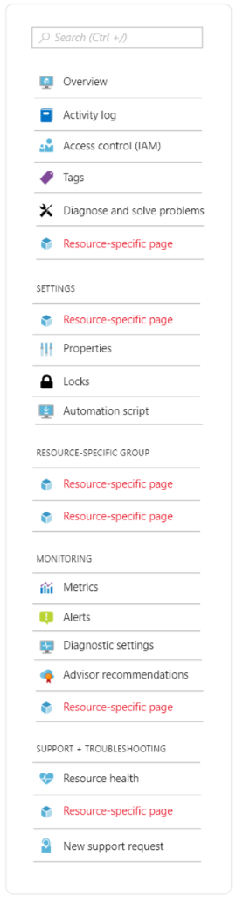
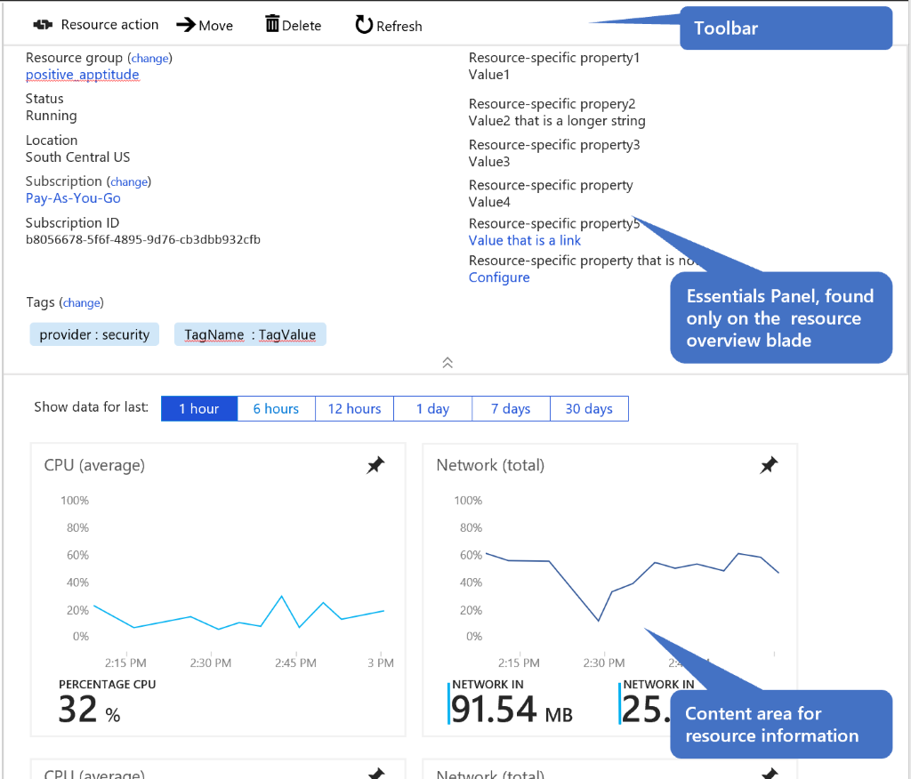

# Resource Manage 
The Resource Manage pattern provides the configuration and management of a single Azure resource.

# Problem
Users manage many different types of Azure resources. For settings that are common across resources, users expect a common interaction. For settings that are unique to a resource, users need a way to easily find those settings.

# Solution
The Resource Manage pattern is used to configure and manage a single Azure resource. The resource manage page is typically opened from the resource browse page, when the user needs to see more details or make a change to a specific resource. The resource manage page can also be opened from related resources that link to it.

## Also known as 
-   Resource blade 
-   Resource detail
-   Resource menu  

# Examples
---------

## Example images

## Example uses
These Azure resources are good examples of this design pattern 

-   Redis cache
-   [Virtual machines](https://rc.portal.azure.com/#blade/HubsExtension/Resources/resourceType/Microsoft.Compute%2FVirtualMachines)

# Use when 
Managing a single azure resource.

## Anatomy  
The resource manage pattern is a full screen experience composed of a resource menu and corresponding resource blades. Settings that are common across resources have a standard menu item and menu location so that users can easily find them.

A resource manage experience usually contains (EW - need to fix abstracted anatomy):

1. Resource menu
2. Resource pages opened from the menu items, command bar, commands or links

## Getting started with resource manage 

How to create the resource manage experience 
1. Use the ResourceMenu SDK building block 
2. Design resource menu to include the common items and resource specific items 
   - Enable the recommended flags to show typical menu items linked to common pages 
   - Add resource-specific menu items to built in groups as necessary 
   - Add resource-specific menu groups and items, provided you are not creating menu groups with fewer than 3 items   
   - Add keywords to your menu items to help the user find menu items by searching the resource menu 
3. Design and Build an Overview page, which serves as the home page for the resource 

## Behavior 

### Resource menu
The resource menu surfaces all pages related to the resource. The navigation includes pages that are common to all resources throughout the portal. Your resource will get those "for free," while some common pages require onboarding by the resource provider. You can add as many pages to your resource as you need. Refer to the image below to make sure each new item is grouped properly. Learn more [Resource Menu](top-blades-resourcemenublade.md)

### Overview page
The overview page is the home page for a resource. It provides customers with key information about the resource, thus saving them clicks and time by not always having them drill deeper.     

### Resource pages   
Each menu item opens a page that allows the user to drill deeper for more information. Monitoring 
pages requires additional onboarding to Geneva Resource health requires additional onboarding by RP. 

### Toolbar 
Toolbar commands should open context panes instead of narrow blades to avoid horizontal scrolling. Learn more [Toolbar](portalfx-controls-toolbar.md), [Context pane](top-extensions-context-panes.md)

### Essentials panel
The essentials panel surfaces properties that are common throughout all Azure
resources as well as important resource specific properties. User feedback has
shown us that our customers rely heavily on the essentials panel for looking up
information. Learn more [portalfx-extensions-essentials.md](./portalfx-extensions-essentials.md)

### Content
* *Must* meet the performance bar – the overview page is the most viewed blade for your resource   
* Content to guide the user to get the most from the resource  
* Resource properties to indicate important resource configuration  
* Resource performance metric graphs to indicate whether resource is functioning properly   

## Do 

* Opt in to ResourceMenu using the AssetType UseResourceMenu="true" option

* Enable the recommended flags on your resources

* Enable tags (includeTags:true) on the essentials panel
* Open context blades for user input and short summaries 

* Ensure you have efficient APIs to get data for your overview page  

* Build your overview page as a template blade   

* Assign keywords to your Resource Menu items to help the user find items   

* Drive your RP teams to onboard to monitoring and resource health services   

* Drive your RP teams to onboard for health and troubleshooting   

* Do leverage a status bar for resource level or page level messaging (error, warning, info, upsell)   

## Don't 

* Don’t create resource-specific menu groups that have only one menu item   

* Don’t put so much information on your resource overview page that it fails the performance bar. You'll end up removing it to meet the bar.   

* Don’t build your overview page as a PDL blade   

# Related design patterns
===============
* Resource Create [top-designpatterns-resource-create.md](top-designpatterns-resource-create.md)
* Resource Browse [top-designpatterns-resource-browse.md](top-designpatterns-resource-browse.md)
* Design patterns readme [portalfx_designpatterns_readme.md](portalfx_designpatterns_readme.md)

# Research and usability
Coming soon

# Telemetry
Coming soon

# For developers 

## Tips and tricks 

* Use the ResourceMenu blade to get started building your resource manage experience

* Make your resource menu static to meet the performance bar 

* Make sure you have efficient APIs for overview data 

* Make sure your RP has onboarded to Geneva for metrics and logs so you can
enable the monitoring menu items 

* Make sure your RP has onboarded to health services so you can enable the
diagnose/troubleshooting and resource health menu items 

* To display tags in the Essentials Panel, add this line to the options object
passed to the essentials control:  includeTags:true 

## Related documentation

* Resource Menu [top-blades-resourcemenublade.md](./top-blades-resourcemenublade.md)
* Essentials [portalfx-extensions-essentials.md](./portalfx-extensions-essentials.md)
* Toolbar control [portalfx-controls-toolbar.md](portalfx-controls-toolbar.md) 
* Context Pane [top-extensions-context-panes.md](top-extensions-context-panes.md)
* Properties page
