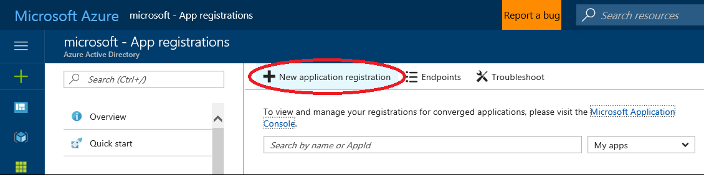

## Overview

Many alerts for extension behavior are provided by the Portal Framework. Alerts run at a specified time to assess the data that was collected in a previous time period. If a threshold for an alert is met, an ICM alert that contains the details of the alert is opened and sent to  the  team that owns the extension. 

The Portal Framework provides the following alerts.

1. Extension SDK expiration

    A Sev3 IcM incident for an extension when its SDK is older than 60 days, and a Sev2 IcM incident for an extension when its SDK is older than 90 days

1. Extension alive

The Framework also provides an infrastructure so that teams can configure alerts to send for each extension. Each area of the infrastructure is separate, so that the Framework can allow various levels of custom configuration. Specified sets of conditions are met previous to meeting or exceeding the alert threshold. The Portal Framework and extensions can send the following alerts.

1. [Create regression](#create-regression)

1. [Availability](#availability)

1. [Performance](#performance)

1. [Client error](#client-error)

<!-- TODO: Determine whether this sentence is still accurate.

 Today it only applies to availability, performance and client error, we are working on expanding it into the other areas.
 -->    

Azure Portal partner team IcM information is collected during the onboarding process, and is located at [https://aka.ms/portalfx/partners](https://aka.ms/portalfx/partners). This maps extension names to IcM team names and service names. An IcM routing rule is added under "Azure Portal (Ibiza) service" in IcM to route incidents to corresponding partners.   The routing rule is in the following format.

 `AIMS://AZUREPORTAL\Portal\{ExtensionName}`

The Portal backs up  JSON extension customizations  from **Azure SQL** to **Kusto** daily at 5:00 pm PST.  You can view your extension alert customization Json in **Kusto** by using the site located at [https://aka.ms/portalfx/alerting-kusto-partner](https://aka.ms/portalfx/alerting-kusto-partner) and replacing `DefaultCriteria` with `Alert_YOUR_EXTENSION_NAME`. Another function is  the Kusto function named `GetExtensionCustomizationJson("YOUR_EXTENSION_NAME")`. The function for your extension will not exist until you onboard the extension to the alerting infrastructure, as specified in [#onboarding-to-the-alert-infrastructure](#onboarding-to-the-alert-infrastructure). You can also view  a read-only version of the configuration after onboarding by using  the alerting tool that is located at [https://aka.ms/portalfx/alerting-onboarding](https://aka.ms/portalfx/alerting-onboarding). 

For client error messages,  replace `ErrorAlert_Ibiza_Framework` with `ErrorAlert_YOUR_EXTENSION_NAME`.

* National Clouds

    The first level of infrastructure allows programmatic access to the National Clouds for core alerting only. AAD Service Principals are only available to  local vendors in National Clouds, instead of  Microsoft employees. To connect with a National Cloud, you will use a dSTS Service Identity. These are supported in all clouds, including the public cloud, so you can prepare  your code for  National Cloud compatibility by using these identities now. The Kusto documentation for this is located at [http://aka.ms/portalfx/kusto-dsts](http://aka.ms/portalfx/kusto-dsts).
    
The following sections specify how to onboard your team to the Framework alert infrastructure, and how to configure alerts for your extension.

* [Onboarding to the alert infrastructure](#onboarding-to-the-alert-infrastructure)

* [Alert configuration](#alert-configuration)

* * *


## Onboarding to the alert infrastructure

1. Generate the desired extension alert configuration by manually editing the JSON file, or by using the alerting tool that is located at [https://aka.ms/portalfx/alerting-onboarding](https://aka.ms/portalfx/alerting-onboarding).
    
1. Fill out the work item that is located at  [https://aka.ms/portalfx/alerting-onboarding](https://aka.ms/portalfx/alerting-onboarding).

1. Set up the following correlation rules in ICM.

    * **Routing ID**: For create regressions the id is `AIMS://AZUREPORTAL\Portal`. For all others, the id is `AIMS://AZUREPORTAL\Portal\\{ExtensionName}`.
 
    * **Correlation ID**:  Alert-specific.  Use the following values.

        * Extension availability alerts: **ExtensionLoadAvailability**

        * Blade availability alerts: **BladeLoadAvailability**

        * Part availability alerts: **PartLoadAvailability**

        * Client Error percentage alerts: **ErrorAffectedUserPercentage**

        * Client Error message alerts:  **ErrorMessage**

        * Create regression alerts:  **CreateBladeSuccessRate**
        
        * Extension performance alerts: **ExtensionLoadPerformance**

        * Blade performance alerts: **BladeLoadPerformance**

        * Part performance alerts: **PartLoadPerformance**

    * **Mode**: Hit count is the recommended mode. Other modes are .

    * **Match DC/Region**: Checked.

    * **Match Slice**: Checked.

    * **Match Severity**: Checked.
 
    * **Match Role**: Checked.

    * **Match Instance/Cluster**: Checked.

If the correlation rules need to be updated for your extension, reach out to 
<a href="mailto:ibizafxhot@microsoft.com;azurefxg@microsoft.com?subject=Extension Alert Configuration&body=My team would like to update the correlation rules for our extension.  The configuration to update is <Alert_YOUR_EXTENSION_NAME>.  The updated configuration is attached.">ibizafx hot@microsoft.com and azurefxg@microsoft.com</a>  and attach the updated configuration. The email to azurefxg@microsoft.com should contain the information specified in [#programmatic-onboarding](#programmatic-onboarding). We will inform you when the updates are applied. 

## Programmatic onboarding

The email to azurefxg@microsoft.com should confirm the following items.

1. A brief reason why you need access.

1. Which databases (AzurePortal, AzPtlCosmos, hostingservice) you require access to.

    **NOTE**: Ibiza only provides Viewer (read) access to the log databases.

1. You understand that programmatic access to these databases potentially allows 'anonymous' access to the uncensored production logs.

1. You are following Microsoft procedures for key storage.
    Typically, this means storing the certificate in KeyVault and rotating the key at the appropriate frequency, as specified in [top-extensions-hosting-service.md#configuring-contentunbundler-for-ev2-based-deployments](top-extensions-hosting-service.md#configuring-contentunbundler-for-ev2-based-deployments).

1. Your handling of any data you access this way complies with Microsoft PII & GDPR policies. This means, but is no way limited to:

    1. Not copying or downloading non-anonymized logs, even to secure systems, unless you have registered those systems with GDPR for deletion and export. 

   1. Not making available anonymous access by proxy. For example, a web site or other access mechanism that allows the caller, whether or not they are authenticated, to make non-delegated requests as the service principal. One  example of such is  a log search tool that connects directly as the Service Principal or dSTS Service Identity rather than using delegated authentication.

1. Your application must not put excessive load on the cluster, especially over peak times like 5 - 7pm PST, or midnight - 1am UTC. 

    * Please supply examples of the queries you will be executing, as well as the schedule or frequency.
    
    * The AAD App ID of your Service Principal or the certificate thumbprint of your dSTS Service Identity. If using an AAD Service Principal, your application uses cert based auth for its Service Principal. For more information, see [#creating-a-certificate-backed-partner-service-principal](#creating-a-certificate-backed-partner-service-principal).

1. A contact e-mail for this application that we can reach out to in cases of outage, capacity planning, and similar support features. This is a team alias instead of an individual email.

1. If you are using the **Kusto** Client SDK to connect, that  `ClientRequestProperties.Application` is set to an appropriate value. If you are using another access method that supports a similar feature, ensure that the extension connects with it.

1. Whether you need to create your own functions and tables, including write access in **Kusto**. This means  creating a dedicated database for your team with a suitable name that you supply, for which you will then be responsible for maintaining, including registering with the GDPR scanner, or other similar entities.  If you are not sure  whether you need your own functions or tables, answer this as "No" and file a new request with <a href="mailto:ibizafxhot@microsoft.com;azurefxg@microsoft.com?subject=Extension Alert Configuration Changes&body=My team would like to update the correlation rules for our extension.  The configuration to update is <Alert_YOUR_EXTENSION_NAME>.  The updated configuration is attached.">ibizafx hot@microsoft.com and azurefxg@microsoft.com</a>  if the answer changes.

Once azurefxg@microsoft.com receives and approves the onboarding request, they will reach out to you.  When your identities are validated, they will enable your app ID with Viewer access for the requested databases. There is no propagation delay associated with  enabling programmatic access.

**NOTE**: **Kusto** is a shared capacity system. As such, we reserve the right to shut down applications that put excessive load on the system. 

### Creating a certificate backed partner service principal

**NOTE**:  If you have custom or  multiple tenants, make sure you  have switched back to the default Microsoft tenant first.

The following steps create the application and a default service principal. Make a note of the Application ID GUID. If you already have an application, you can skip forward to the PowerShell part.

1. Go to [https://aka.ms/portalfx/newapp](https://aka.ms/portalfx/newapp).

1. Click 'New application registration', as in the following image.

    

    
1. Fill out the application registration. The values are as follows.

    1. **Name**: Your application's friendly name

    1. **Application Type**: Choice only matters if you have users signing into your app. Pick the type most appropriate to your extension.

    1. **Sign-on URL**: Choice only matters if you have users signing into your app. 

1. Click 'Create'.

The following Powershell steps add the  certificate credential to a service principal.

1. Install the Azure Active Directory (MSOnline) CommandLets that are located at [http://aka.ms/portalfx/aad-commandlets](http://aka.ms/portalfx/aad-commandlets) if you haven’t already, and open an elevated PowerShell prompt.

1. Execute the following code to get the public key from a cert file. You may also get the public key in another way, such as by thumbprint.

    ```ps
    $cer = New-Object System.Security.Cryptography.X509Certificates.X509Certificate 
    $cer.Import("C:\temp\ServicePrincipalCertPublicKey.cer")
    $binCert = $cer.GetRawCertData()
    $credValue = [System.Convert]::ToBase64String($binCert);
    ```

1. Connect to AAD, and get a reference to your application's service principal (SP), and add the certificate. If it does not work, repeat these steps by using an elevated **PowerShell** shell.

    ```ps
    import-module MSOnline
    Connect-MsolService
    $sp = Get-AzureRmADServicePrincipal -ServicePrincipalName yourApplicationId
    New-MsolServicePrincipalCredential -ObjectId $sp.Id -Type asymmetric -Value $credValue -StartDate 
    $cer.GetEffectiveDateString() -EndDate 
    $cer.GetExpirationDateString()
    ```

You can rotate  a certificate  by running the `New-MsolServicePrincipalCredential` for the new certificate, then removing (when ready to do so) the old certificate through `Remove-MsolServicePrincipalCredential`.

## Alert configuration

At a high level, an alert configuration specifies the number of environments that will use the alert.  Then, the environments are grouped into sets that use the same alert, or defined individually, using the **environment** parameter. Within that environment, the  availability configuration for the alerts within that environment is specified.

A sample alert is in the following code.

```json
{
    "extensionName": "Your_Extension_Name",
    "enabled": true,
    "environments": [
        {
            "environment": ["ms.portal.azure.com"], 
            "availability": [...], // Optional. Add it when you want to enable availability alerts.
            "clientError": [...], // Optional. Add it when you want to enable client error alerts.
            "create": [...], // Optional. Add it when you want to enable create alerts.
            "performance": [...] // Optional. Add it when you want to enable performance alerts.
        },
        {
            "environment": ["portal.azure.com", "portal.azure.cn"], // National clouds are supported.
            "performance": [...] // Optional. Add it when you want to enable performance alerts.
        }
    ]
}

```

The parameters are as follows.

* **extensionName**: The name of the extension.

* **enabled**: Specifies whether to use the alert.  A value of `true` enables the alert, and a value of `false` disables the alert.

* **environments**:  The array whose elements represent a set of alerting criteria for an environment.

* **environment**:  The array whose elements represent the names of the environments for the alert. Multiple values can be set for this property. The values can be the MPAC and PROD environments, in addition to portal domain names like  "canary.portal.azure.com" or "portal.azure.cn". An asterisk ("&ast;") represents all Azure Portal Production environments, like *.portal.azure.com. Alerts are supported in national clouds by specifying national cloud portal domain names. The  national cloud domain names are "portal.azure.cn", "portal.azure.us", and "portal.microsoftazure.de". You can use any valid national cloud domain name, for example, "aad.portal.azure.cn", as in the following example.

    ```json
        {
        ...
        "environments": [
            {
                "environment": ["portal.azure.com", "ms.portal.azure.com", "portal.azure.cn"],
                ...
            },
            {
                "environment": ["portal.azure.cn","portal.azure.us", "portal.microsoftazure.de"],
                ...
            },
            {
                "environment": ["portal.azure.us", "portal.microsoftazure.de"],
                ...
            }
            ...
        ]
        ...
    }
    ```

At least one of the following four sections must be included to provide the details of the alert. The alert areas are as follows.

* [Create regression](#create-regression)

* [Availability](#availability)

* [Performance](#performance)

* [Client error](#client-error)

## Create regression

Alerts can be configured for create regressions on different environments including national clouds. Create regression  alerts run every sixty minutes to assess the previous hour of data and the previous 24 hours of data. Alerts will only trigger for a blade when the following criteria are met.

* The hourly create success rate is below **minSuccessRateOverPastHour**  and hourly create totalcount is above {minTotalCountOverPastHour}

* The 24-hour create success rate is below **minSuccessRateOverPast24Hours** and 24-hour create totalcount is above {minTotalCountOverPast24Hours}

A sample create regression alert is in the following code.

```json
{
     "environments": [
        {
            "environment": ["portal.azure.com", "portal.azure.cn"],
            "availability": [...], // Optional
            "clientError": [...], // Optional.
            "create": [
                 {
                    "type": "regression",
                    "enabled": true,
                    "criteria": [
                       ...
                    ]
                }
            ],
            "performance": [...], // Optional.
        },
        {
            "environment": ["ms.portal.azure.com"],
            "create": [
                {
                    ...
                }
                ...
             ]
            ...
        }
        ...
    ]
    ...
}
```

The parameters are as follows.

 * **type**: Contains the value "regression".

* **enabled**: Specifies whether to use the create regression criteria.  A value of `true` enables the alert criteria, and a value of `false` disables the alert criteria.

The following example contains the criteria for a create regression error alert.

```json
    "criteria":[
        {
            "severity": 3,
            "enabled": true,
            "bladeName": ["CreateBlade"],
            "minSuccessRateOverPast24Hours":94.0,
            "minSuccessRateOverPastHour":94.0,
            "minTotalCountOverPast24Hours":50,
            "minTotalCountOverPastHour":3
        }
    ]
```

* **severity**:  The priority of the alert. An alert that is prioritized as severity 1 receives immediate attention due to factors like portal outage.  Lower severity alerts are priorized appropriately.

* **enabled**: Specifies whether to use the create regression criteria.  A value of `true` enables the alert criteria, and a value of `false` disables the alert criteria.

* **bladeName**: The list of  create blade names.

* **minSuccessRateOverPast24Hours**: This is the minimum create blade success rate over the past 24 hours.

* **minSuccessRateOverPastHour**: This is the minimum create blade success rate over the past hour.

* **minTotalCountOverPast24Hours**: This is the minimum number of create that gets kicked off over the past 24 hours.

* **minTotalCountOverPastHour**: This is the minimum number of create that gets kicked off over the past hour.

## Availability 

Alerts can be configured for extension availability, blade availability and part availability on different environments including national clouds. Availability alerts run every five minutes to assess the previous hour of data.  A sample availability alert is in the following code.

```json
     "availability": [
        {
            "type": "extension", // Support value, "extension", "blade" or "part".
            "enabled": true,  // Enable or disable this criteria.
            "criteria": [
            ...
            ]
        },
        {
            "type": "blade",
            "enabled": true,
            "criteria": [
            ...
            ]
        }
        ...
        {
            "type": "part",
            "enabled": true,
            "criteria": [
            ...
            ]
        }
        ...      
    ],

```

The parameters are as follows.

* **type**: Specifies whether the alert is for extensions, blades, or parts. Values are "extension", "blade", and "part".

* **enabled**: Specifies whether to use the availability criteria.  A value of `true` enables the alert criteria, and a value of `false` disables the alert criteria.

Within the availability criteria, two different sets of custom criteria can be specified. Blades and parts are required to have a **namePath** property. Only blades or parts can be configured as an inclusion or exclusion model, as in the following  example that contains the criteria for an availability  alert.

```json
    "criteria": [
        "severity": 3, // Support value 0, 1, 2, 3 or 4.
        "enabled": true, // Enable or disable this alert criteria.
        "minAvailability": 80.0,
        "minFailureCount": 5,
        "minFailureUserCount": 10,
        "namePath": ["*"], // Only support for blade or part type.
        "exclusion": [
            "Extension/Your_Extension_Name/Blade/BladeNameA",
            "Extension/Your_Extension_Name/Blade/BladeNameB"], // Only support for blade or part type.
        "safeDeploymentStage": ["3"], // Optional. It does not support asterisk("*") sign.
        "datacenterCode": ["AM"] // Optional.
    ]

```

* **severity**:  The priority of the alert. An ICM alert that is fired as severity 1 receives immediate attention due to factors like portal outage.  Lower severity alerts are prioritized appropriately. 

* **enabled**: A Boolean that specifies whether to use the alert criteria.

* **minAvailability**: The minimum availability, expressed as a percentage. For example, an extension fails to load 20 out of 100 times has a minimum availability rating of 80%, or 80% available.

* **minFailureCount**: The minimum number of failures that have occurred. In the previous  example,  the configuration requires 5 or more failures for a critical failure.

* **minFailureUserCount**: The minimum number of unique users that encountered a failure previous to meeting or exceeding the error threshold.

* **namePath**: This only applies to blades or parts. Specifies  what blades or parts can send the alert. This parameter can specify a list of full blade or part names to alert on, or it can contain an asterisk("*")   to include all the blades or parts within the  extension. The **minAvailability**, **minFailureCount** and **minFailureUserCount** are applied to every individual blades or part that is included in this parameter.

* **exclusion**:  This only applies to blades or parts. Specifies what blades or parts cannot send this alert.

* **safeDeploymentStage**:  Optional. Safe deployment stages are represented by the values are "0", "1", "2", and "3". Each stage deploys to a batch of regions, as specified in [https://aka.ms/portalfx/alerting/safe-deployment-stage](https://aka.ms/portalfx/alerting/safe-deployment-stage).  If this parameter is omitted, alerting does not take stages into consideration when calculating availability, failureCount and failureUserCount, and therefore those statistics are accumulated  over all regions instead of by safe deployment stage.

* **datacenterCode**: Optional. Datacenters are represented by the codes  "AM", "BY", and others, as specified in [https://aka.ms/portalfx/alerting/datacenter-code-name](https://aka.ms/portalfx/alerting/datacenter-code-name). An asterisk ("*") represents all Azure Portal Production regions.  If this parameter is omitted, alerting does not take datacenter into consideration when calculating availability, failureCount and failureUserCount, and therefore those statistics are accumulated over all datacenters. 

Availability alerts will trigger when **minFailureUserCount**, **minFailureCount**, and **minAvailability** are met or exceeded.  In this example, which is safe deployment stage 3 and datacenter "AM", for all blades in extension "Your_Extension_Name" except for blades "BladeNameA" and "BladeNameB", the alert assesses the data that was accumulated during last hour. Based on that data, the alert will only fire when 10 or more unique users encounter 5 or more failure occurrences and the total availability decreasses to 80%.  If all three of these conditions are met, then a severity 3 alert will be opened and sent to the team that owns the blade or part.

## Performance

The alerts can be configured for extension performance, blade performance and part performance on different environments including national clouds.

Performance alerts run every 10 minutes to assess the previous 90 minutes of data. The Portal gets the most recent 6 sample points and calculates a weighted percentile load duration based on the following formula.

```
Weighted duration = 8/24 * {most recent percentile load duration} + 6/24 * {2nd most recent percentile load duration} + 4/24 * {3rd…} + 3/24 * {4th …} + 2/24 * {5th …} + 1/24 * {6th …}
```

Alerts will only trigger when one of the following criteria is met.

* Weighted duration is above {percentileDurationThresholdInMilliseconds} and affected user count is above {minAffectedUserCount}

* Weighted duration is above 2 * {percentileDurationThresholdInMilliseconds} and affected user count is above {bottomMinAffectedUserCount}

A sample performance  alert is in the following code.

 ```json
    "performance": [
            {
            "type": "extension", // Support value, "extension", "blade" or "part".
            "enabled": true, // Enable or disable extension type alerts for Your_Extension_Name.
            "criteria": [
                ...
            ]
        },
        {
            "type": "blade",
            "enabled": true,
            "criteria": [
                ...
            ]
        }
        ...
    ]
...
```

The parameters are as follows.

 * **type**: Contains the value  "regression".

* **enabled**: Specifies whether to use the create regression criteria.  A value of `true` enables the alert criteria, and a value of `false` disables the alert criteria.

The following example contains the criteria for a performance  alert.

```json
{
     "severity": 3, // Support value 0, 1, 2, 3 or 4.
    "enabled": true, // Enable or disable this criteria.
    "percentile": 95, // Support value 80 or 95.
    "percentileDurationThresholdInMilliseconds": 4000,
    "minAffectedUserCount": 10,
    "bottomMinAffectedUserCount": 2,
    "namePath": ["*"], // Only support for blade or part type.
    "exclusion": [
        "Extension/Your_Extension_Name/Blade/BladeNameA",
        "Extension/Your_Extension_Name/Blade/BladeNameB"], // Only support for blade or part type.
    "safeDeploymentStage": ["3"], // Optional. It does not support asterisk("*") sign.
    "datacenterCode": ["AM"] // Optional.
}
```

* **severity**:  The priority of the alert. An ICM alert that is fired as severity 1 receives immediate attention due to factors like portal outage.  Lower severity alerts are prioritized appropriately. 

* **enabled**: A Boolean that specifies whether to use the alert criteria.

* **percentile**: This is the percentile at which  to measure the performance. Valid values are 80 or 95.

* **percentileDurationThresholdInMilliseconds**: This is the minimum duration, expressed in milliseconds, when the percentile of users is above the threshold.  

* **minAffectedUserCount**: This is the minimum number of users whose load duration is above **percentileDurationThresholdInMilliseconds**.

* **bottomMinAffectedUserCount**: This is used as a threshold to trigger an alert if the **percentile** defined is greater than or equal to twice  the defined percentileThreshold. The default is 20% of **minAffectedUserCount**. This is used to catch any unusual spikes on the weekends or in low traffic periods.

* **namePath**: This only applies to blades or parts. Specifies  what blades or parts can send the alert. This parameter can specify a list of full blade or part names to alert on, or it can contain an asterisk("*")   to include all the blades or parts within the  extension. The **minAvailability**, **minFailureCount** and **minFailureUserCount** are applied to every individual blades or part that is included in this parameter.

* **exclusion**:  This only applies to blades or parts. Specifies what blades or parts cannot send this alert.

* **safeDeploymentStage**:  Optional. Safe deployment stages are represented by the values are "0", "1", "2", and "3". Each stage deploys to a batch of regions, as specified in [https://aka.ms/portalfx/alerting/safe-deployment-stage](https://aka.ms/portalfx/alerting/safe-deployment-stage).  If this parameter is omitted, alerting does not take stages into consideration when calculating availability, failureCount and failureUserCount, and therefore those statistics are accumulated  over all regions instead of by safe deployment stage.

* **datacenterCode**: Optional. Datacenters are represented by the codes  "AM", "BY", and others, as specified in [https://aka.ms/portalfx/alerting/datacenter-code-name](https://aka.ms/portalfx/alerting/datacenter-code-name). An asterisk ("*") represents all Azure Portal Production regions.  If this parameter is omitted, alerting does not take datacenter into consideration when calculating availability, failureCount and failureUserCount, and therefore those statistics are accumulated over all datacenters. 

## Client error

The two types of client error alerts are error percentage alerts and error message alerts. Error percentage alerts fire when the percentage of users experiencing an error is above the specified threshold. Error message alerts fire on specified error messages. 

Error percentage alerts run every 15 minutes, and error message alerts run every five minutes.  They assess the previous 60 minutes of telemetry data that is stored in the **Kusto** database.

 A sample client error alert is in the following code.

```json
{
    "clientError": [
        {
            "type": "message",
            "enabled": true,
            "criteria": [
                ...
            ]
        },
        {
            "type": "percentage",
            "enabled": true,
            "criteria": [
                ...
            ]
        }
    ],
 }
```

The parameters are as follows.

* **type**: The type of client error message that triggers an alert. The values are **message** and **percentage**. A message  can have one type or both types. For **message** errors, you can specify up to 3 messages in one criteria.  

* **enabled**: Specifies whether to use the alert type.  A value of `true` enables the alert type, and a value of `false` disables the alert type. 

* **criteria**: The criteria for the client error alert. Any number of criteria can be specified within each type. 
As many as three  messages can be specified in one criterion. 

The following example contains the criteria for a **message** error alert.
            
```json
    "criteria":[
        {
            "severity": 4,
            "enabled": true,
            "checkAllNullRefs": true, // Optional.
            "message1": "Cannot read property", // Optional.
            "message2": "of null", // Optional.
            "minAffectedUserCount": 1,
            "exclusion": {
                "type": "or", // Only support value "and", "or".
                "message1":"eastus2stage",
                "message2":"eastus2(stage)"
            },
            "safeDeploymentStage": ["3"], // Optional. It does not support asterisk("*") sign.
            "datacenterCode": ["AM"] // Optional.
        },
        ...
    ]
```

The following example contains the criteria for a **percentage** error alert.

```json
    "criteria":[
    {
        "severity": 3,
        "enabled": true,
        "minAffectedUserCount": 2,
        "minAffectedUserPercentage": 10.0,
        "exclusion": {
            "type": "or", // Only support value "and", "or".
            "message1":"eastus2stage",
            "message2":"eastus2(stage)"
        },
        "safeDeploymentStage": ["3"], // Optional. It does not support asterisk("*") sign.
        "datacenterCode": ["AM"] // Optional.
    },
    ...
    ]
```

The parameters for the criteria are as follows.

* **severity**:  The priority of the alert. An alert that is prioritized as severity 1 receives immediate attention due to factors like portal outage.  Lower severity alerts are priorized appropriately.

* **enabled**: Specifies whether to use the error alert criteria.  A value of `true` enables the alert criteria, and a value of `false` disables the alert criteria.

* The following parameters are for message alerts only.

    * **checkAllNullRefs**: Optional.  A value of `true` makes the alert check all the null refs client errors.  and a value of `false` means the alert does not check those errors.  The value of this field does not affect whether the additional conditions of **message1** and **message2** can be specified. 

    * **message1**: Optional. The error string that alerts look for in client error logs, specifically in [message] column at (Client|Ext)Events log table.  You can specify up to 3 messages in one criteria. The search uses a  logical AND relation to locate the messages in the table.  All the messages that were specified in this criteria element must be present in a client error message([message] column at (Client|Ext)Events log table) to count as an error.

    * **message2**: Optional. Additional error message to include in this alert. See **message1**.

* **minAffectedUserCount**:  The minimum number of unique users that were affected by any client error.

* The following parameter is for percentage alerts only.
              
    * **minAffectedUserPercentage**:  The minimum percentage of unique users that were affected by any client error.

* **exclusion**:  Specifies the condition(s) that do not count as a client error, and therefore do not send this alert. As many as three messages can be specified. 
    
    * **type**: The logical operator for messages in the **exclusion** property. Valid values are "and" and "or".  "and" means when all the messages specified in "exclusion" property are present in a client error message, error alerts would not count it as a client error. "or" means when any of the messages specified in "exclusion" property is present in a client error message, error alerts would not count it as a client error. 

    * **message1**: The error string(s) that alerts do  not count as a client error when they are present in a client error message([message] column at (Client|Ext)Events log table).

    * **message2**: See **message1**. 
            
* **safeDeploymentStage**:  Optional. Safe deployment stages are represented by the values are "0", "1", "2", and "3". Each stage deploys to a batch of regions, as specified in [https://aka.ms/portalfx/alerting/safe-deployment-stage](https://aka.ms/portalfx/alerting/safe-deployment-stage).  If this parameter is omitted, alerting does not take stages into consideration when calculating availability, failureCount and failureUserCount, and therefore those statistics are accumulated  over all regions instead of by safe deployment stage.

* **datacenterCode**: Optional. Datacenters are represented by the codes  "AM", "BY", and others, as specified in [https://aka.ms/portalfx/alerting/datacenter-code-name](https://aka.ms/portalfx/alerting/datacenter-code-name). An asterisk ("*") represents all Azure Portal Production regions.  If this parameter is omitted, alerting does not take datacenter into consideration when calculating availability, failureCount and failureUserCount, and therefore those statistics are accumulated over all datacenters. 
