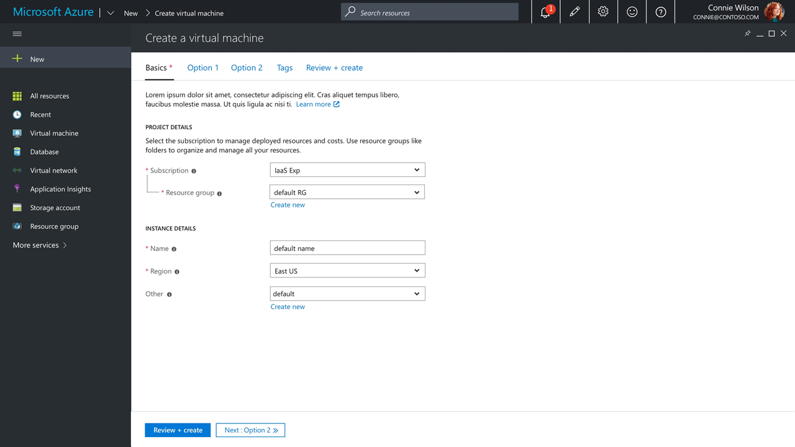
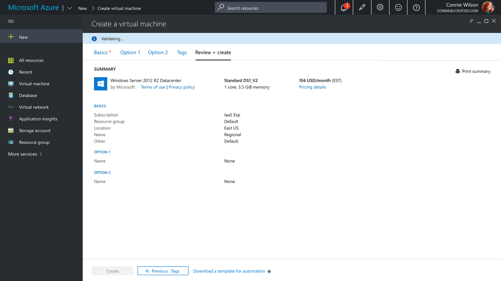

## Create

### Overview

The create experience is one of the most important customer journeys within the portal. Which is why our designers have spent many months testing and validating different design guidelines. Our most recent design incorporates a full screen blade and uses horizontal tabs to help organize different configuration settings into sections. The goal is to develop a consistent, simple, intuitive, and quick customer experience across resources.

Ask a `create` questions on [Stack Overflow](https://stackoverflow.microsoft.com/questions/tagged/ibiza-create)
	
### Getting Started

The  most recent Portal SDK contains a sample create in `SamplesExtension/Client/V2/Create/Engine/CreateArmEngineBlade.ts`. This sample uses NoPDL and includes 3 essential tabs and 2 optional tabs. All the styling and validation patterns are included and can be easily augmented to meet your needs. The remainder of this document is intended to help you understand the key design principles and create a consistent experience.

### Related design guidelines

-   Create a Resource [top-design-patterns-resource-create.md](top-design-patterns-resource-create.md)

### Design Principles

Here are the top 5 guidelines you should follow when designing your Create form:

1. Full screen single blade with no side blades.
2. Horizontal wizard using existing Tabs control.
3. Allow customers to easily and freely navigate between tabs.
4. Be descriptive and supportive.
5. Ability to quickly deploy resources with minimal input.

### Navigation

Use the tabs control & sections to organize content. The Basics tab should be the starting point for all creates and where essential configurations should be placed. The design should allow for quick deployments at any time with unrestricted navigation between tabs. Enabling customers to freely navigate reduces the friction for customers looking to learn about your resource which can lead to additional deployments.

	
### Tabs

Most creates should have a minimum of 3 tabs; Basics, Tags, Review + create.  All other tabs are optional.

**Basics**:  Should contain most of the required elements needed to deploy a resource successfully.   Set default values when possible to eliminate additional time spent on create.
	
**Tags**:  Tagging resources during creates is now supported when using the Tags control.  Subscription and Resource Group level policies may require users to tag resources during create.  Not including the Tags control may block users from deploying resources.
	
**Review + create**:   Allows customers to review configured and defaulted settings before procuring resources.  Use the Summary control to organize and display key/value pairs before create.  Validations are performed before users can successfully submit.  See Validations below for further details.

### Tab Layout

**Descriptions**: The top of each tab should include a brief description about the content to follow. When possible include `Learn more` links to relevant docs.

**Project Details**: Represents the collection of Subscription and Resource Group controls.  To include the visual connector between Subscription and RG, set `Nested = True` on the RG control.  The default text for Project Details is `Select the subscription to manage deployed resources and costs. Use resource groups like folders to organize and manage all your resources.`

**Section Headers**: Used to separate common settings within a tab.

**Alignment**: Stack labels above controls if the screen resolution < 700px.
	
**Info Bubbles**: All form controls should include help text.
	
### Sub Creates

When creating a sub resource use the sub label property to add a `Create new` link to open a new blade within a context pane.   Avoid using side blades.

{"gitdown": "include-section", "file": "../samples/SamplesExtension/Extension/Client/V2/Create/Engine/CreateArmEngineBlade.ts", "section": "docs#SubCreate"}

### Tags

The Tags control, allows users to assign key value pairs to selected Resource Types.	

Include the `tagMap` of a resource from the `TagsByResource` control when constructing the parameters required by the ARM template.  Note: `tagMap` must be converted from an array to a `StringMap`.
	
{"gitdown": "include-section", "file": "../samples/SamplesExtension/Extension/Client/V2/Create/Engine/CreateArmEngineBlade.ts", "section": "docs#AddTagMapToARMParmeters"}

### Review + Create

Allowing the user to verify all settings prior to submission ensures accuracy and reduces the need for user redeployments.  Use the summary control to help organize content from multiple tabs.  Disable the create button until validation succeeds.

### Setting up the create button
	
{"gitdown": "include-section", "file": "../samples/SamplesExtension/Extension/Client/V2/Create/Engine/CreateArmEngineBlade.ts", "section": "docs#CreateButton"}

### Validations

Validating the form and template is an essential part of the create process.  When the `Review + create` tab is loaded, validations begin and a status bar is used to communicate status. The first step evaluates the form for incomplete fields or invalid entries.  The second step validates the ARM template. If validation succeeds the `Create` button is enabled for submission.