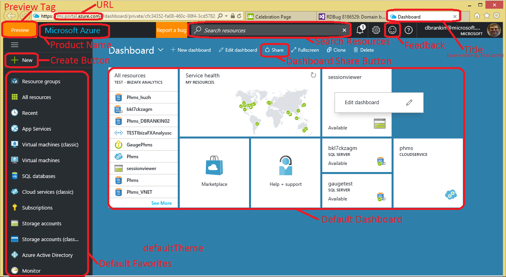
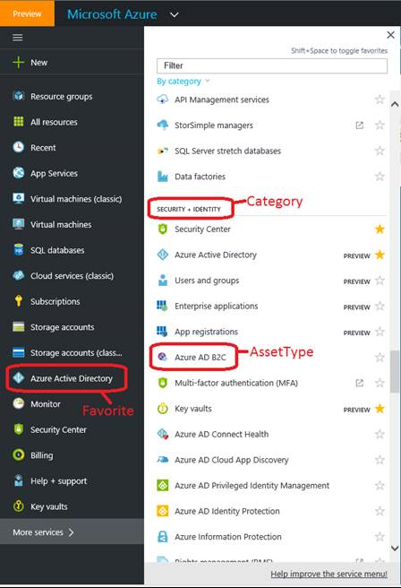

# Custom Domains

* [Domain based configuration](#domain-based-configuration)

* [Exposing config settings to the client](#exposing-config-settings-to-the-client)

* [Dictionary configuration](#dictionary-configuration) 

* [Exporting domain based configuration values to the client](#exporting-domain-based-configuration-values-to-the-client) 

* [Custom Domain Questionnaire Template](#custom-domain-questionnaire-template) 

* [Branding and Chrome](#branding-and-chrome)

* [Feature flags](#feature-flags)

* [Curation](#curation)

* [Tile Gallery](#tile-gallery) 

* [Override Links](#override-links)

## Domain based configuration

Domain-based configuration allows the Portal and Extensions to dynamically obtain settings based on the URL that was used to access the Portal. For example, accessing the Portal by using the `contoso.portal.azure.com` URL displays different values for domain-based settings than the `portal.azure.com` URL displays.

The first-party or third-party developer identifies the functionality that an extension will use, based on the domain in which the extension is running. Once the partner and developer have identified the configurations for the extension, the developer creates a supporting `DictionaryConfiguration` class as specified in [Dictionary Configuration](#dictionary-configuration). The dictionary key is the host name the Shell was loaded under, which is available at run time by using `PortalContext` and `TrustedAuthorityHost`.

Some partner needs can be met at the deployment level. For example, national clouds like China, Germany, or Government, can use normal configuration with no dynamic tests at runtime.  Examples that are based on which domain  is running the extension include  ARM and RP URLs, or AAD client application IDs.  In other instances, a single deployment of an extension supports multiple domains.  For example, community clouds, like Fujitsu A5, use domain-based configuration.  In these instances, functionality is selected based on the Trusted Authority for the calling extension, as specified in [#The-TrustedAuthorityHost-function](#the-trustedauthorityhost-function). 

While domain-based configuration is not required to support national clouds, there is great overlap between settings that are changed for community clouds. It is often easier to store settings like links in domain-based configuration. Additionally, domain-based configuration includes support for expanding links from link redirection, or from shortener services such as **FwLink** and `aka.ms` services.

Extensions that are called contain additional code that pushes values to the browser.  The consumption example located at [consumption example](#consumption-example) demonstrates the pattern that wires up server-side domain-based configuration.

**NOTE**: Settings like ARM endpoints are not typically candidates for domain-based configuration.

**NOTE**: It is recommended that domain-based configuration class names have the characters `DomainBasedConfiguration` appended to them. Some examples are `ErrorApplicationDomainBasedConfiguration`, `HubsDomainBasedConfiguration`, and `WebsiteDomainBasedConfiguration`. However, this naming convention is not required.

**NOTE**: Domain-based configuration is based on the domain host address of the Shell, instead of the extension. Extensions do not need to support additional host names in order to take advantage of domain-based configuration.

* [Domain based configuration APIs](#domain-based-configuration-apis)

* [Exposing config settings to the client](#exposing-config-settings-to-the-client)

* [Dictionary configuration](#dictionary-configuration)

If you have any questions, reach out to Ibiza team at [https://stackoverflow.microsoft.com/questions/tagged?tagnames=ibiza](https://stackoverflow.microsoft.com/questions/tagged?tagnames=ibiza).

## Configuration APIs

 The Shell provides two APIs to support domain-based configuration. The following is the recommended implementation methodology, although partners and developers can implement domain-based configuration in many ways.

* [The getSharedSettings function](#the-getSharedSettings-function)

* [The TrustedAuthorityHost function](#the-trustedAuthorityHost-function)

### The getSharedSettings function

In the `MsPortalFx.Settings.getSharedSettings()` function, selected values from Shell are exposed through an RPC call for the following reasons.

 1. Each extension does not have to have its own copy of commonly defined values, such as the support URL.

 1. Changes to shared settings do not require simultaneous redeployment of extensions.
 
The first call by the extension to this API results in an RPC call from the extension to Shell. After that, the results are served from a cache.
 
The `MsPortalFx.Settings.getSharedSettings()` API returns an object whose root is empty and reserved for future use, except for a `links` property that contains the following links collection structure, as defined in `src\SDK\Framework\TypeScript\MsPortalFx\SharedSettings.d.ts`.

| Element Name          | Description                                    |
| --------------------- | ---------------------------------------------- | 
| accountsPortal        | Link to the Accounts portal                    | 
| classicPortal         | Link to the Classic portal                     | 
| createSupportRequest  | Link to the create support request UI          | 
| giveFeedback          | Link to the feedback UI                        | 
| helpAndSupport        | Link to the help and support UI                | 
| learnRelatedResources | Link to the learn related resources help topic | 
| manageSupportRequests | Link to the manage support request UI          | 
| privacyAndTerms       | Link to the privacyAndTerms UI                 | 
| resourceGroupOverview | Link to resource groups overview               | 

<!-- TODO: Determine whether the following description of the root of this object is still current. -->

Links are automatically expanded according to the user's domain, tenant, and language preferences. Links can be any of the following.

*  Full URLs like external links

*  Fragment URLs like blade links

*  `String.Empty`

    In this instance, the feature is not supported for that user / tenant / environment combination.

The consuming extension should support all three formats if they take a dependency.
 
### The TrustedAuthorityHost function

The Server-side `PortalContext.TrustedAuthorityHost` function returns the host name under which the extension was loaded. For example, an extension named may need to know if it is being called from `portal.azure.com` or `Contoso.azure.com`. In the first case `TrustedAuthorityHost` will contain "portal.azure.com" and in the second, "contoso.azure.com".
 
**NOTE**: If the extension needs to change its configuration based on the domain of the caller, the recommended solution is to use domain-based configuration, which is designed specifically for this sort of work.  It is preferred over coding directly against values returned by `PortalContext.TrustedAuthorityHost`.

## Exposing config settings to the client

Configuration settings are commonly used to control application behavior like timeout values, page size, endpoints, ARM version number, and other items. With the .NET framework, managed code can easily load configurations; however, most of the implementation of a Portal extension is client-side JavaScript.

By allowing the client code in extensions to gain access to configuration settings, the Portal framework provides a way to get the extension configuration and expose it in `window.fx.environment`, as in the following steps.

1. The Portal framework initializes the instance of the  `ApplicationConfiguration` class, which is located in the   **Configuration** folder in the VS project for the extension. The instance will try to populate all properties by finding their configurations in the `appSettings` section of the  `web.config` file. For each property, the Portal framework will use the key "{ApplicationConfiguration class full name}.{property name}" unless a different name is specified in the associated `ConfigurationSetting` attribute that applied that property in the `ApplicationConfiguration` class.

1. The Portal framework creates an instance of `window.fx.environment` for the client script. It uses the mapping in the `ExtensionConfiguration` dictionary in the `Definition.cs` file that is located in the `Controllers` folder.

1. The client script loads the configuration from `window.fx.environment` that implements the `FxEnvironment` interface. To declare the new configuration entry, the file `FxEnvironmentExtensions.d.ts` in the `Definitions` folder should be updated for each property that is exposed to the client.

### Configuration procedure

This procedure assumes that a Portal extension named "MyExtension" is being customized to add a new configuration called "PageSize". The source for the samples is located in the `Documents\PortalSDK\FrameworkPortal\Extensions\SamplesExtension` folder.

**NOTE**: In this discussion, `<dir>` is the `SamplesExtension\Extension\` directory, and  `<dirParent>`  is the `SamplesExtension\` directory, based on where the samples were installed when the developer set up the SDK. 

1. Open the `ApplicationConfiguration.cs` file that is located in the  `Configuration` folder.

1. Add a new property named `PageSize` to the sample code that is located at `SamplesExtension\Extension\` directory, and to the code that is located at `<dirParent>\Extension\Configuration\ArmConfiguration.cs`. The sample is included in the following code.

    <!--TODO: Customize the sample code to match the description -->

     gitdown": "include-section", "file": "SamplesExtension/Extension/Configuration/ArmConfiguration.cs", "section": "config#configurationsettings"}

1. Save the file.

    **NOTE**: The namespace is `Microsoft.Portal.Extensions.MyExtension`, the full name of the class is `Microsoft.Portal.Extensions.MyExtension.ApplicationConfiguration`, and the configuration key is `Microsoft.Portal.Extensions.MyExtension.ApplicationConfiguration.PageSize`.

1. Open the `web.config` file of the extension.

1. Locate the `appSettings` section. Add a new entry for PageSize.

    ```xml
    ...
      <appSettings>
            ...
            <add key="Microsoft.Portal.Extensions.MyExtension.ApplicationConfiguration.PageSize" value="20"/>
      </appSettings>
      ...
    ```

1. Save and close the `web.config` file.

1. Open the `Definition.cs` file that is located in the `Controllers` folder. Add a new mapping in `ExtensionConfiguration` property.

    ```csharp
        /// <summary>
        /// Initializes a new instance of the <see cref="Definition"/> class.
        /// </summary>
        /// <param name="applicationConfiguration">The application configuration.</param>
        [ImportingConstructor]
        public Definition(ApplicationConfiguration applicationConfiguration)
        {
            this.ExtensionConfiguration = new Dictionary<string, object>()
            {
                ...
                { "pageSize", applicationConfiguration.PageSize },
            };
            ...
        }
    ```

1. Open the `FxEnvironmentExtensions.d.ts` file that is located in the  `Definitions` folder, and add the `pageSize` property in the environment interface.

    ```ts
        interface FxEnvironment {
            ...
            pageSize?: number;
        } 
    ```

1. The new configuration entry is now defined. To use the configuration, add code like the following in the script.

    ```JavaScript
        var pageSize = window.fx.environment && window.fx.environment.pageSize || 10;
    ```

An extended version of this procedure is used to transfer domain based configurations, like correctly formatted FwLinks, to the client. 

## Dictionary configuration

The `DictionaryConfiguration` class allows strongly-typed JSON blobs to be defined in the configuration file, and selected based on an arbitrary, case-insensitive string key. For example, the Shell and Hubs use the class to select between domain-specific configuration sets. Two configuration classes can be created.

1. A configuration class that is derived from `DictionaryCollection` that manages and exposes the instances.

1. A stand-alone settings class that contains the setting values associated with a specific key and user culture.

Like other configuration classes, these are named and populated from the config based on namespace, class name, and the Settings property name. For example, if the namespace is `Microsoft.MyExtension.Configuration` and the configuration class is `MyConfiguration`, then the configuration setting name is `Microsoft.MyExtension.Configuration.MyConfiguration.Settings`.

Instances of configuration classes are normally obtained through MEF constructors, and this is unchanged for `StringDictionaryConfiguration` and its sub-classes.

At runtime, the strongly typed settings for a specific key are obtained by using the `GetSettings` method that is inherited by the configuration class, as in the following code.

 `T settings = configClass.GetSettings(string key, CultureInfo culture)` 
 
 The `culture` parameter is optional, and is used when expanding settings that are marked with the special `[Link]` attribute. If the `culture` parameter  is not specified, the default is  `CultureInfo.CurrentUICulture`.

  A boilerplate example is located at [consumption example](#consumption-example).

* The configuration class

    To create a configuration class, derive a class from `StringDictionaryConfiguration&lt;T&gt;`, where `T` is the type of the settings class.

    Remember to mark the class as MEF exportable if the config will be made available in the normal fashion, as in the following example.

    ```cs
    namespace Microsoft.MyExtension.Configuration
    {
        [Export]
        public class MyConfiguration : DictionaryConfiguration<MySettings>
        {
        }
    }
    ```

    Nested objects, like `Billing.EA.ShowPricing`, are fully supported, as in the example code located at [consumption example](#consumption-example).

* The settings class

    The settings class is a data transport object. The following example  contains the configuration class name `MySettings`, in addition to the settings class's namespace `Microsoft.MyExtension.Configuration`.

    All properties that are populated from the JSON blob in the configuration file are marked as `[JsonProperty]` so that the configuration system `ConfigurationSettingKind.Json` option can be used. If the properties are not marked, they will not be deserialized and will remain null.

    ```
    <table>
        <thead><tr><th>Example settings class</th><th>Example config*</th></tr></thead>
        <tr>
            <td>
                <pre>
    namespace Microsoft.MyExtension.Configuration
    {
        public class MySettings
        {
            [JsonProperty]
            public bool ShowPricing { get; private set; }
        }
    }
                </pre>
            </td>
            <td>
    <pre>
    &lt;add key="Microsoft.MyExtension.Configuration.MyConfiguration.Settings" value="{
        'default': {
            'showPricing': true
        },
        'someOtherKey' : {
            'showPricing': false
        }
    }" /&gt;
    </pre>
            </td>
        </tr>
    </table>
    ```

    **NOTE**: The deserializer handles camel-case to pascal-case conversion when the code uses JSON property name conventions in the config file and C# name conventions in the configuration classes.
 
#### Use of the Link attribute

If the property is marked `[Link]` then link expansion logic will be applied in the following

If the string is numeric, it will be expanded according to the format string specified in the `LinkTemplate` property at the root of the object. Occurrences of `{linkId}` in the string will be expanded to the numeric value. If no `LinkTemplate` property is specified, the value will be left unexpanded.

Occurrences in the string of `{lcid}` will be replaced with the hex representation of the user's preferred .NET LCID value (for example, 409 for US English). Occurrences in the string of `{culture}` will be replaced with the user's preferred .NET culture code (for example, en-US for US English).

A LinkTemplate value of `https://go.microsoft.com/fwLink/?LinkID={linkId}&amp;clcid=0x{lcid}` is the correct template for FwLinks.

An exception will be thrown if the target of a `[Link]` attribute is not in one of the following string formats.

1. Numeric (e.g. '12345' )

1. A URL hash-fragment (e.g. #create\Microsoft.Support)

1. A http or https URL

#### The 'default' key

If no exact match is found for the specified key (or the caller passes null), Get returns the settings associated with a key whose name is `default`.

### Setting inheritance

`DictionaryConfiguration` supports a simplistic one-level inheritance model to avoid having to repeat unchanged settings in 'subclassed' config. 

If a property inside the settings for a non-default key is missing or explicitly set to null,  the value for that property is set to the value from the default key. For example:

``` xml
    <add key="Microsoft.Portal.Framework.WebsiteDomainBasedConfiguration.Settings" value="{
        'default': { 'setting1': 'A1', 'setting2': 'A2' },
        'config2': { 'setting1': 'B1', 'setting2': 'B2' },
        'config3': { 'setting1': 'C1' },
        'config4': { 'setting1': null },
    }"/>
```

Will return:

| Key    | Setting 1 | Setting 2 |Notes |
Default|A1       |A2       |
Config1|A1       |A1       |Since there is no config1 entry, the default is returned
Config2|B1       |B2       |Both values were overridden
Config3|C1       |A2       |Only setting1 was overridden
Config4|A1       |A2       |Assigning null is the same as skipping the property
-----------------------------------

## Exporting domain based configuration values to the client

In many cases, the domain-based configuration is needed in client-side **TypeScript**. While the extension developer is free to do this any way they want, we recommend the following for extensions following our recommended practices / templates:

1. In ExtensionExtensionDefinition.cs, add your configuration class to your ImportContructor and save it away for later use

2. Override `IReadOnlyDictionary&lt;string, object&gt; GetExtensionConfiguration(PortalRequestContext context)` 
and use this to extend the environmental object being returned to the client. For example:

```cs
    public override IReadOnlyDictionary<string, object> GetExtensionConfiguration(PortalRequestContext context)
    {
        var extensionConfig = base.GetExtensionConfiguration(context);
        var settings = this.myConfig.GetSettings(context.TrustedAuthorityHost, CultureInfo.CurrentUICulture);

        var mergedConfig = new Dictionary<string, object>()
        {
            {"links", settings.Links},
            {"someSetting", settings.someSetting},
        };

        mergedConfig.AddRange(extensionConfig);

    return mergedConfig;
}
```

3. Update `ExtensionFxEnvironment.d.ts` to include TypeScript definitions for the new values you are downloading to the client.


### Consumption example

The following three examples demonstrate how to 

* Consumption example 

    ```cs
    [ImportingConstructor]
    public MyConsumingClass(PortalContext portalContext, MyConfiguration myConfiguration)
    {
        this.portalContext = portalContext;
        this.myConfiguration = myConfiguration;
    }
    ...
    public void DoSomthing()
    {
        var settings = this.myConfiguration.Get(this.portalContext.TrustedAuthorityHost, CultureInfo.CurrentUICulture);
        if (settings.ShowPricing) {...};
        string expandedUrl = settings.GettingStarted;
    }
    ```

* Configuration and settings classes

    ```cs
    namespace Microsoft.MyExtension.Configuration
    {
        [Export]
        public class MyConfiguration : DictionaryConfiguration<MySettings>
        {
        }

        /// <summary>Configuration that can vary by the domain by which the user accesses the portal (or some other string)</summary>
        public class MySettings
        {
            [JsonProperty]
            public string LinkTemplate { get; private set; }
    
            [JsonProperty]
            public MyLinks Links { get; private set; }
    
            [JsonProperty]
            public bool ShowPricing{ get; private set; }
        }

        /// <summary>Links don't have to be a separate class, I just like to group them separately to other settings</summary>
        public class MyLinks
        {
            [JsonProperty, Link]
            public string GettingStarted { get; private set; }
    
            [JsonProperty, Link]
            public string Support { get; private set; }
    
            [JsonProperty, Link]
            public string TermsAndConditions { get; private set; }
        }
    }
    ```

* Corresponding example config settings

    This example supports a deployment that returns different run-time configuration values for the settings class. Which value is returned is dependent on whether the portal was accessed through portal.azure.com, example.microsoft.com, fujitsu.portal.azure.com, or hostfileoverride.com.

    The configuration block is in the following code.

    ```xml
    <add key="Microsoft.MyExtension.Configuration.MyConfiguration.Settings" value="{
        'default': {
            'linkTemplate': 'https://go.microsoft.com/fwLink/?LinkID={linkId}&amp;clcid=0x{lcid}',
            'links': {
                'gettingStarted': '111111',
                'support': '#create/Microsoft.Support',
                'termsAndConditions': 'https://microsoft.com',
            },
            'ShowPricing': true,
        },
        'fujitsu.portal.azure.com' : {
            'links': {
                'gettingStarted': '222222',
                'support': '',
                'termsAndConditions': 'https://fujitsu.com',
            },
            'ShowPricing': false,
        },
        'example.microsoft.com': {
            'ShowPricing': false,
        }
        }"/>
    ```

    The following code would call the previous code block.

    ```cs
        var config = this.myConfiguration.Get(this.portalContext.TrustedAuthorityHost, CultureInfo.CurrentUICulture);
    ``` 

    The call to the code block gives the following results.

    URL user used to access the portal|User's culture|config.showPricing|config.links.gettingStarted|config.links.support|config.links.termsAndConditions
    ----------------------------------|--------------|------------------|---------------------------|--------------------|-------------------------------
    portal.azure.com        |en-us  |true |https://go.microsoft.com/fwLink/?LinkID=111111&clcid=0x409|#create/Microsoft.Support|https://microsoft.com
    portal.azure.com        |zh-hans|true |https://go.microsoft.com/fwLink/?LinkID=111111&clcid=0x4|#create/Microsoft.Support|https://microsoft.com
    fujitsu.portal.azure.com|en-us  |false|https://go.microsoft.com/fwLink/?LinkID=222222&clcid=0x409||https://fujitsu.com
    example.micrtosoft.com  |en-us  |false|https://go.microsoft.com/fwLink/?LinkID=111111&clcid=0x409|#create/Microsoft.Support|https://microsoft.com
    hostFileOverride.com    |en-us  |true |https://go.microsoft.com/fwLink/?LinkID=111111&clcid=0x409|#create/Microsoft.Support|https://microsoft.com
 
***NOTE**: The only URL that matters is the one through which the Portal is accessed. The URL that is used to access the extension is not relevant and does not change.

## Custom Domain - Questionnaire Template

The following template contains questions that your team answers previous to  the granting of your custom domain. You may want to make a copy and fill the details.

1. Why do you need a Custom Domain?

1. What is the name of the extension in Ibiza Portal?

1. When do you expect your extension to be ready for deployment?

1. What timelines are you looking to go live? 

    | Requirement | Estimated Completion Date |
    | ----------- | ------------------------- |
    | Azure Portal team PM Lead approval |    |
    | Completed Questionnaire |               |
    | Completed Default Dashboard Json |      |
    | Planning for Dev work |   1 week        |
    | Dev work                    | Requires 3-4 weeks after scheduling subject to resource availability | 
    | Deployments                 | Post dev work 2-3 weeks to Prod based on Safe deployment schedule | 

1. URL

	| Setting name / notes	| Public Value	        | Your value                       |
    | --------------------- | --------------------  | -------------------------------- |
    | Production URL        | `portal.azure.com`    | `aad.portal.azure.com`           |
    | Dogfood URL           | `df.portal.azure.com` | `df-aad.onecloud.azure-test.net` |
 
## Branding and Chrome

The following image is the Azure Dashboard.



The following table specifies the parts in the dashboard image.

| Setting name / notes | Description | Public Value | Your value |
| -------------------- | ----------- | ------------ | ---------- |
| Product Name | The text that appears on the top bar | Microsoft Azure | Azure Active Directory admin center (don't translate Azure Active Directory) |
| Title | The text that appears on the Browser tab/title bar.  (written to the page’s `<TITLE>` element) | Microsoft Azure | Azure Active Directory admin center |
| Description | SEO text that is included in the page source (not end-user visible) | Microsoft Azure Management Portal | Azure Active Directory admin center for administrators |
| defaultTheme | The default color theme for the portal | blue |  light |
| hideCreateButton | Hides the Create ("+ New") Button | false |  true |
| hideDashboardShare | Hides the Dashboard Share Button | false | true |
| hidePartsGalleryPivots | Hides parts types picker from parts gallery. Does not disable the category picker  | false | true |
| hideSearchBox | Hides the “Search resources” box | false | true |
| hiddenGalleryParts | Hides listed parts from the parts gallery (e.g. All Resources, Service Health, …)  | empty | (only include markdown, clock and video, help & support) |
 
## Feature flags

Recommended details are prepopulated. 

| Setting name / notes	    | Public Value  | Your Value 	(recommended values shown)  | 	Notes  | 
| ------------------------- | ------------  | --------------------------------------  | -------- |
| feedback	| true	| true |  	False hides feedback smiley icon on top bar (see screenshot above).  | 
| hidesupport	 | (not set) | 	false	 | Hides support functionality in property and other select dialogs.  | 
| internalonly | 	false	 | false | 	Controls whether the Orange ‘Preview’ tag appears to the left of the site name (see screenshot above)  | 
| nps | 	true | 	true | 	Controls whether the Net Promoter Score (‘How likely are you to recommend this site?’) prompt can appear for the site. Recommend set to false.  | 
| hubsextension_skipeventpoll	 | (not set)	 | true	 | Disables ‘what’s new’ and subscription level notifications (such as deployment complete for VMs). Recommend set to true unless showing all resource types from all extensions. | 
 
## Curation

Curation controls the visibility and grouping of browsable asset types in the Favorites and Browse portions of left nav (see Terminology screenshot below). A browsable asset type is one defined in your (or someone else’s) PDL using the <Browse> tag.

Your cloud can customize how browseable assets appear in the Favorites and Category sections. This is all optional (you can just inherit from production if you want).


	 
Curation allows the listed items to be added, removed, and reordered. It is important to note that Curation only hides items from the left nav, not from code or deep links. This means, for (fictional) example, you can hide the ability to create a new Storage Accounts from users while still allowing your extension to open the Storage Accounts property and usage logs blades for the storage account you created behind the scenes for one of your assets.
 
### Category Curation

The Category curation model provides a significant degree of flexibility, which can be overwhelming at first as the following options are NOT mutually exclusive:
  
		○ Based on Production
Take the production curation definition and programmatically modify it. For example, ‘Remove everything except assets from these 3 extensions’ or ‘Change the Category that items from extension3 live under’.
			 
		Note: Empty categories are automatically hidden.
		
		The most common configurations are:
			§ Community Clouds that show just assets from your extension, Help & Support, and that will automatically add new browsable assets 
Use Curation by AssetType listing just items from your extension (plus some items from Help & Support if desired), combined with Curation by Extension to allow new asset types you deploy to appear while your updates to your Curation by AssetType are waiting on the next Shell deployment, combined with a DiscoveryPolicy of Hide to prevent new asset types from other extensions appearing.
		
		- All AAD extensions except "KeyVault" and "Help + Support"
		- Default all items to go under "Security + Identity" category (including help and support)
	
	 
### Default Favorites

When a new user visits your Community Cloud for the first time, the system places a number of assets types in the far left drawer. You can control which items are placed here and the order in which they are displayed. The only restriction is that these items must also exist in the Category Curation.
	 
| Extension Name | Asset ID | Comments |
| -------------- | -------- | -------- |
| MICROSOFT_AAD_IAM | AzureActiveDirectory  |  |
| MICROSOFT_AAD_IAM | AzureActiveDirectoryQuickStart | Not implemented yet | 
| MICROSOFT_AAD_IAM | UserManagement |  | 
| MICROSOFT_AAD_IAM | Application |  | 
| MICROSOFT_AAD_IAM | Licenses | Not implemented yet | 
 
* Azure Active Directory
* Quick start
* Users and groups
* Enterprise apps
* Licenses
	
Items will be added in the order listed.
 
### Default Dashboard

The default dashboard JSON controls what parts appear on the dashboard for new users. Existing users need to use the `Reset Dashboard` option to see updated versions of the default dashboard. The following steps generate the JSON. 

1. Use the Portal’s `customize` mode to manually create the dashboard.  Pin or drag and drop the dashboard contents into place.

1. Use the Portal’s `Share` feature to publish the dashboard to an Azure subscription.

 **NOTE**: The subscription is  not related to your content; this is just a means to an end.

1. Navigate to `More Services -> Resource Explorer` and find the dashboard that was  just published. The `Resource Explorer` will display the JSON representation of the dashboard.  You can review and adjust  the tile sizes, positions, and settings.  

1. Inspect the JSON to confirm that it contains no user-specific values, because this dashboard will be applied to all new users.

1. Paste the following `AzureActiveDirectoryDashboardv2.json` File from AAD into the Default Dashboard JSON. The file is also located at [](). 

    ```
    {
        "properties": {
            "lenses": {
                "0": {
                    "order": 0,
                    "parts": {
                        "0": {
                            "position": {
                                "x": 0,
                                "y": 0,
                                "rowSpan": 2,
                                "colSpan": 4
                            },
                            "metadata": {
                                "inputs": [],
                                "type": "Extension/Microsoft_AAD_IAM/PartType/OrganizationIdentityPart"
                            }
                        },
                        "1": {
                            "position": {
                                "x": 4,
                                "y": 0,
                                "rowSpan": 2,
                                "colSpan": 4
                            },
                            "metadata": {
                                "inputs": [],
                                "type": "Extension/Microsoft_AAD_IAM/PartType/AzurePortalWelcomePart"
                            }
                        },
                        "2": {
                            "position": {
                                "x": 0,
                                "y": 2,
                                "rowSpan": 2,
                                "colSpan": 4
                            },
                            "metadata": {
                                "inputs": [],
                                "type": "Extension/Microsoft_AAD_IAM/Blade/ActiveDirectoryBlade/Lens/ActiveDirectoryLens/PartInstance/ActiveDirectory_UserManagementSummaryPart"
                            }
                        },
                        "3": {
                            "position": {
                                "x": 0,
                                "y": 4,
                                "rowSpan": 2,
                                "colSpan": 4
                            },
                            "metadata": {
                                "inputs": [
                                    {
                                        "name": "userObjectId",
                                        "isOptional": true
                                    },
                                    {
                                        "name": "startDate",
                                        "isOptional": true
                                    },
                                    {
                                        "name": "endDate",
                                        "isOptional": true
                                    },
                                    {
                                        "name": "fromAppsTile",
                                        "isOptional": true
                                    }
                                ],
                                "type": "Extension/Microsoft_AAD_IAM/PartType/UsersActivitySummaryReportPart"
                            }
                        },
                        "4": {
                            "position": {
                                "x": 0,
                                "y": 6,
                                "rowSpan": 1,
                                "colSpan": 2
                            },
                            "metadata": {
                                "inputs": [],
                                "type": "Extension/Microsoft_AAD_IAM/PartType/ADConnectStatusPart"
                            }
                        },
                        "5": {
                            "position": {
                                "x": 2,
                                "y": 6,
                                "rowSpan": 1,
                                "colSpan": 2
                            },
                            "metadata": {
                                "inputs": [],
                                "type": "Extension/Microsoft_AAD_IAM/PartType/AuditEventsDashboardPart"
                            }
                        },
                        "6": {
                            "position": {
                                "x": 4,
                                "y": 2,
                                "rowSpan": 4,
                                "colSpan": 4
                            },
                            "metadata": {
                                "inputs": [],
                                "type": "Extension/Microsoft_AAD_IAM/PartType/ActiveDirectoryRecommendationPart",
                                "viewState": {
                                    "content": {
                                        "selection": {
                                            "selectedItems": [],
                                            "activatedItems": []
                                        }
                                    }
                                }
                            }
                        },
                        "7": {
                            "position": {
                                "x": 8,
                                "y": 0,
                                "rowSpan": 2,
                                "colSpan": 2
                            },
                            "metadata": {
                                "inputs": [],
                                "type": "Extension/Microsoft_AAD_IAM/PartType/ActiveDirectoryQuickTasksPart"
                            }
                        },
                        "8": {
                            "position": {
                                "x": 8,
                                "y": 2,
                                "rowSpan": 1,
                                "colSpan": 2
                            },
                            "metadata": {
                                "inputs": [],
                                "type": "Extension/Microsoft_AAD_IAM/PartType/AzurePortalPart"
                            }
                        }
                    }
                }
            },
            "metadata": {
                "model": {
                    "timeRange": {
                        "value": {
                            "relative": {
                                "duration": 24,
                                "timeUnit": 1
                            }
                        },
                        "type": "MsPortalFx.Composition.Configuration.ValueTypes.TimeRange"
                    }
                }
            }
        },
        "id": "/subscriptions/8bd095e7-b4a6-4f9c-b826-8b83943111fa/resourceGroups/dashboards/providers/Microsoft.Portal/dashboards/438319b8-6761-4c27-9f1f-97b12413c30b",
        "name": "438319b8-6761-4c27-9f1f-97b12413c30b",
        "type": "Microsoft.Portal/dashboards",
        "location": "eastasia",
        "tags": {
            "hidden-title": "Dashboard"
        }
    }
    ```

    <!--TODO:  Locate a copy that can be linked to from here, instead of the following OneNote link.
    [https://microsoft.sharepoint.com/teams/azureteams/aapt/azureux/portalfx/_layouts/OneNote.aspx?id=%2Fteams%2Fazureteams%2Faapt%2Fazureux%2Fportalfx%2FSiteAssets%2FPortalFx%20Notebook&wd=target%28Execution%2FFundamentals%2FDeployments.one%7C9B8BE2F4-DDEF-4504-982B-560AF50A892C%2FCustom%20Domain%20-%20Questionnaire%20Template%7C90BDECEB-D69D-4BA0-B60A-8A9EBB877CC4%2F%29](https://microsoft.sharepoint.com/teams/azureteams/aapt/azureux/portalfx/_layouts/OneNote.aspx?id=%2Fteams%2Fazureteams%2Faapt%2Fazureux%2Fportalfx%2FSiteAssets%2FPortalFx%20Notebook&wd=target%28Execution%2FFundamentals%2FDeployments.one%7C9B8BE2F4-DDEF-4504-982B-560AF50A892C%2FCustom%20Domain%20-%20Questionnaire%20Template%7C90BDECEB-D69D-4BA0-B60A-8A9EBB877CC4%2F%29)
    -->

## Tile Gallery

The tile gallery is visible when the user clicks on `Edit dashboard`. It displays a collection of tiles that can be dragged and dropped on the dashboard. Available tiles can be searched by Category, by Type, by resource group, by tag, or by using the Search string.

* The `hidePartsGalleryPivot` flag disables all the search types except the Category search. The Category selector will be displayed only if any tile has a category assigned to it.

* The `hiddenGalleryParts` list allows this extension to hide specific parts that are made available by other extensions. For example, by default, the Service Health part is always displayed, but it can be hidden by adding it to this list.
 
## Override links

Your cloud has the option of using settings to override specific links that are displayed by the system. Overriding is optional, and in many cases no overrides are required. Where supported, settings use FwLinks for links instead of absolute URLs because FwLinks do not require the Shell to be redeployed in order for the extension to change the destination. Also, FwLinks support the user’s in-product language selection, which is often different from the browser’s default language.  For example, if the user has set the language in the Portal to Chinese, it should display Chinese-language pages.

Each link can be specified as one of the following five values.

* A numeric FwLink ID

* A blade reference

* An absolute URL

    Absolute URL's can be assigned friendly names by using the site located at [http://aka.ms](http://aka.ms).

* The word "blank"

    The link should be hidden and not displayed to the user.

* The word "same"

    The default production value should be used. If the default production value changes, that change is automatically propagated to your extension.

Links are separated into the following three sections.

* [Shell Links](#shell-links)

* [Hubs links](#hubs-links) 

* [Error Page Links](#error-page-links)

<sup>1</sup> Items do not support FwLinks or blade references because  they are  download links, or they are base URLs to which  parameter or path information is added dynamically at run-time.

<sup>2</sup> Items may not currently support the "blank" setting, or they may not support  values of the types other than the ones listed in the `Public Value` column. If you need to use them, reach out to  <a href="mailto:ibizapxfm@microsoft.com?subject=Settings and Links">ibizapxfm@microsoft.com</a>so that we can work with the owner team.

**NOTE**: Changing to support the unsupported values may result in a delay in delivery time.

* * *

### Shell Links

| Setting name / notes | Public Value | Your Value |
| -------------------- | ------------ | ---------- |
| accessDetails<sup>2</sup> | #blade/HubsExtension/MyAccessBlade/resourceId/ |	blank (verify that menu item is hidden) | 
| accountPortal<sup>1</sup> | https://account.windowsazure.com/ | blank (verify that menu item is hidden) | 
| classicPortal<sup>1</sup> | https://manage.windowsazure.com/	 | same  | 
| createSupportRequest | #create/Microsoft.Support | same |
| giveFeedback | [https://go.microsoft.com/fwLink/?LinkID=522329](https://go.microsoft.com/fwLink/?LinkID=522329) | [https://go.microsoft.com/fwlink/?linkid=838978](https://go.microsoft.com/fwlink/?linkid=838978) | 
| helpAndSupport | 	#blade/Microsoft_Azure_Support/HelpAndSupportBlade | same | 
| learnRelatedResources	| [https://go.microsoft.com/fwLink/?LinkID=618605](https://go.microsoft.com/fwLink/?LinkID=618605) | same  | 
| learnSharedDashboard | [https://go.microsoft.com/fwLink/?LinkID=746967](https://go.microsoft.com/fwLink/?LinkID=746967) | same  | 
| manageSupportRequests | #blade/HubsExtension/BrowseServiceBlade/        assetTypeId/Microsoft_Azure_Support_SupportRequest | same |
| privacyAndTerms | [https://go.microsoft.com/fwLink/?LinkID=522330](https://go.microsoft.com/fwLink/?LinkID=522330)	 | same | 
| resourceGroupOverview	| [https://go.microsoft.com/fwLink/?LinkID=394393](https://go.microsoft.com/fwLink/?LinkID=394393) | same  | 
| survey	| [https://go.microsoft.com/fwLink/?LinkID=733278](https://go.microsoft.com/fwLink/?LinkID=733278)  | 	??? Gauge team to follow up on this | 
| joinResearchPanel | [https://uriux.fluidsurveys.com/s/MicrosoftReseachPanel/](https://uriux.fluidsurveys.com/s/MicrosoftReseachPanel) | same |
| learnAzureCli<sup>2</sup> | 	[https://azure.microsoft.com/en-us/documentation/articles/xplat-cli-azure-resource-manager/](https://azure.microsoft.com/en-us/documentation/articles/xplat-cli-azure-resource-manager/)	 | same |
 
### Hubs links

| Setting name / notes  | Public Value |	Your Value |
| --------------------- | ------------ | ---------- |
| createNewSubscription     | [https://go.microsoft.com/fwLink/?LinkID=522331](https://go.microsoft.com/fwLink/?LinkID=522331)	 | same |
| manageAzureResourceHelp   | [https://go.microsoft.com/fwLink/?LinkID=394637](https://go.microsoft.com/fwLink/?LinkID=394637)	 | same |
| moveResourcesDoc<sup>2</sup>	| [https://go.microsoft.com/fwLink/?LinkID=747963](https://go.microsoft.com/fwLink/?LinkID=747963)	 | same |
| resourceGroupInstallClientLibraries (not found)	| [https://go.microsoft.com/fwLink/?LinkID=234674](https://go.microsoft.com/fwLink/?LinkID=234674)	 | same |
| resourceGroupInstallPowerShell<sup>1</sup>	| [https://go.microsoft.com/fwLink/?LinkID=https://go.microsoft.com/?linkid=9811175](https://go.microsoft.com/fwLink/?LinkID=https://go.microsoft.com/?linkid=9811175)			(download link) | same |
| resourceGroupInstallTools (page not found) | [https://go.microsoft.com/fwLink/?LinkID=94686](https://go.microsoft.com/fwLink/?LinkID=94686)	 | same |
| resourceGroupIntroduction	| [https://go.microsoft.com/fwLink/?LinkID=394393](https://go.microsoft.com/fwLink/?LinkID=394393)	 | same |
| resourceGroupIntroductionVideo	| [https://go.microsoft.com/fwLink/?LinkID=394394](https://go.microsoft.com/fwLink/?LinkID=394394)	 | same |
| resourceGroupResourceManagement	| [https://go.microsoft.com/fwLink/?LinkID=394396](https://go.microsoft.com/fwLink/?LinkID=394396)	 | same |
| resourceGroupSample	| [https://go.microsoft.com/fwLink/?LinkID=394397](https://go.microsoft.com/fwLink/?LinkID=394397)	 | same |
| resourceGroupTemplate	| [https://go.microsoft.com/fwLink/?LinkID=394395](https://go.microsoft.com/fwLink/?LinkID=394395)	 | same |
| subCerts	| [https://go.microsoft.com/fwLink/?LinkID=734721](https://go.microsoft.com/fwLink/?LinkID=734721)	 | same |
| tourHelp	| [https://go.microsoft.com/fwLink/?LinkID=626007](https://go.microsoft.com/fwLink/?LinkID=626007)	 | same |
| templateDeployment	| [https://go.microsoft.com/fwLink/?LinkID=733371](https://go.microsoft.com/fwLink/?LinkID=733371)	 | same |
| tagsHelp<sup>2</sup> | [https://go.microsoft.com/fwLink/?LinkID=822935](https://go.microsoft.com/fwLink/?LinkID=822935)  | same |
| pricingHelp<sup>2</sup> | [https://go.microsoft.com/fwLink/?LinkID=829091](https://go.microsoft.com/fwLink/?LinkID=829091)  | same |
| azureStatus<sup>2</sup> | [https://status.azure.com]()  | same |
 
### Error Page Links
	
| Setting name / notes | Public Value |	Your Value |
| -------------------- | ------------ | ---------- |
| classicPortal<sup>1</sup>	   | https://manage.windowsazure.com/	| same |
| contactSupport |	[https://go.microsoft.com/fwLink/?LinkID=733312](https://go.microsoft.com/fwLink/?LinkID=733312)	 | same |
| html5StorageExceededHelp |	[https://go.microsoft.com/fwLink/?LinkID=522344](https://go.microsoft.com/fwLink/?LinkID=522344)	 | same |
| javaScriptDisabledHelp |	[https://go.microsoft.com/fwLink/?LinkID=530268](https://go.microsoft.com/fwLink/?LinkID=530268)	 | same |
| noHtml5StorageHelp |	[https://go.microsoft.com/fwLink/?LinkID=522344](https://go.microsoft.com/fwLink/?LinkID=522344)	 | same |
| portalVideo |	[https://go.microsoft.com/fwLink/?LinkID=394684](https://go.microsoft.com/fwLink/?LinkID=394684) |	 blank |
| supportedBrowserMatrix |	[https://go.microsoft.com/fwLink/?LinkID=394683](https://go.microsoft.com/fwLink/?LinkID=394683)	 | same |
| unsupportedLayoutHelp	 |[https://go.microsoft.com/fwLink/?LinkID=394683]()	 | same |
 
 {"gitdown": "include-file", "file": "../templates/portalfx-extensions-bp-custom-domains.md"}

 {"gitdown": "include-file", "file": "../templates/portalfx-extensions-faq-custom-domains.md"}
