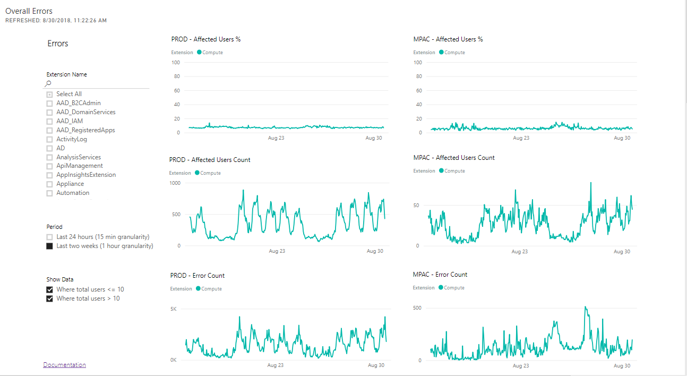

## Overview

Reliability of the Portal is one of the top priorities for our customers. As an extension author you have a duty to uphold your extension to the reliability bar at a minimum. 

| Area          | Reliability Bar     | Telemetry Actions                  | How is it measured? |
| ---------     | ------------------- | ------------------------            | ------------------- |
| Extension     | See Power BI        | ExtensionLoad | (# of ExtensionLoad completes / (# of ExtensionLoad completes + cancels)) * 100 |
| Blade         | See Power BI        | BladeLoaded vs BladeLoadErrored     | (( # of BladeLoaded started - # of BladeLoadErrored's) / # of BladeLoaded started) * 100 |
| Part          | See Power BI        | PartLoaded                          | (( # of PartLoaded started - # of PartLoaded canceled) / # of PartLoaded started) * 100 |

Extension reliability is the core of the customer experience. If the Portal is unable to load your extension, it will be unable to surface any of your experience. Consequently, your customers will be unable to manage or monitor their resources through the Portal.

Second to extension reliability, Blade reliability is the next level of critical reliability. It is similar to a page loading in a website, and failing to load is a critical issue.

Parts are used throughout the Portal, from a blade and dashboard perspective. Parts that fail to load, result in an inability to navigate to a blade or the next blade.  They may also fail to display critical data that the user expects to see on the dashboard, and other factors.

## Assessing extension reliability

There are two methods to assess the reliability of an extension, blade or part.

Performance metrics are located on the PowerBi dashboard, and indicate how well  an extension, blade, or part is performing. These metrics are described in [#performance-metrics](#performance-metrics).

The other method is to examine and correct error conditions that are reported on the dashboard, as specified in [#extension-errors-powerbi-dashboard](#extension-errors-powerbi-dashboard). The error states for extensions, blades, and parts are described in [portalfx-extensions-status-codes.md](portalfx-extensions-status-codes.md).

The combination of these two methods helps to inform extension developers about the performance of an extension, and pinpoints pain points within the extension that leave room for improvement. Extension developers can improve the code within an extension, as specified in [#optimizing-code-to-improve-extension-reliability](#optimizing-code-to-improve-extension-reliability).  

In addition to optimizing code, the Ibiza team recommends using the following guidelines to improve extension performance.

* Improve extension caching

    Extension caching guidelines are located at [portalfx-performance-caching-homepage.md](portalfx-performance-caching-homepage.md) and [portalfx-performance-caching-scripts.md](portalfx-performance-caching-scripts.md).

* Improve extension geo-distribution

    Ensure that your extension is served from a location as close as possible to your users. The Extension Hosting Service that is specifed in [top-extensions-hosting-service.md](top-extensions-hosting-service.md) handles geo-distribution.

* Turn on IIS compression, as specified in [http://aka.ms/portalfx/iiscompression](http://aka.ms/portalfx/compression).

### Performance metrics

You can access the PowerBi dashboard by using the Telemetry onboarding guide that is located at [portalfx-telemetry-getting-started.md](portalfx-telemetry-getting-started.md).  Then, access the Extension performance/reliability report that is located at [http://aka.ms/portalfx/dashboard/extensionperf](http://aka.ms/portalfx/dashboard/extensionperf). This is the easiest way to determine how performant the extension is, as this is maintained on a regular basis by the Ibiza team. You can run queries locally but ensure you are using the Azure-provided Kusto functions to calculate the assessment. This will assist in assess extension performance by data center.

### Extension Errors PowerBi dashboard

The Extension Errors PowerBi dashboard gives you the ability to view the errors and warnings thrown by your extension. It is located at  [http://aka.ms/portalfx/dashboard/ExtensionErrors](http://aka.ms/portalfx/dashboard/ExtensionErrors). Accessing the dashboard requires telemetry access, as specified in  [portalfx-telemetry-getting-started.md#permissions](portalfx-telemetry-getting-started.md#permissions). Extension errors and warnings are tracked only if the extension has been onboarded to the  ExtTelemetry/ExtEvents tables, as specified in [portalfx-telemetry.md](portalfx-telemetry.md). 

All time stamps that are displayed  in this dashboard are UTC time stamps. Currently, the dashboard is  refreshed automatically eight times a day, which is the maximum number of scheduled refreshes allowed by PowerBI. The refreshes occur at the following times during working hours: 8:00 AM, 9:30 AM, 11:00 AM, 12:30 PM, 2:00 PM, 3:30 PM, 5:00 PM and 6:30 PM (Pacific Time).

#### Errors by environment

"Overall Errors by Environment" and "Overall Warnings by Environment" are the charts that you need to monitor. You can  check to see if there are any significant spikes in the report. An example of the "Errors by Environment" report is in the following image, where the environments are MPAC and PROD.




The following three charts are located in each column.

* Affected Users % 
    
    This is the percentage of users that had at least one error, divided by the total number of users that were using the Portal. This chart is used to detect changes in the error percentage pattern.

* Affected Users Count 

    This is the total number of users that had an error that was thrown by the Portal.

* Error Count 

    The total number of errors that were thrown by the Portal.

To hide irrelevant spikes, where the Portal is used by less than 10 users, you can use the options on the left navigation bar. In the `Show Data` section, you can select  the option `Where total users > 10`.

To analyze a spike, you can drill down into the errors thrown by your extension  by navigating  to the "1 Hour Error Drilldown" chart. You can review the errors for a specific hour by using the Kusto functions located at [#azure-portal-database-kusto-functions](#azure-portal-database-kusto-functions).

Error messages are aggregated by omitting the text that is contained in double quotes (") or single quotes ('). Those parts of the message are the dynamic part of the message, like an id or  a timestamp. For example, the message `[Could not find part "PartName1"]` is treated as `[Could not find part ""]`. Your extension should use this format for all logged error messages, so that they can be  aggregated by our queries.

### Errors by hour

Another useful chart is the "Last 4 Hours Error Summary", which displays the errors thrown by an extension, aggregated for the last 4 hours.
 
You can select all the error messages between startTime and endTime by using "*" when looking for the error message. Otherwise, you can search by the entire aggregated error message or just by a part of it.  One example is  'message: Script error'.

You can select the level of events from the left navigation bar.  The  errorTypes are "Error" and "Warning".
 
## How to run dashboard queries

You can run Kusto queries locally to determine your numbers. The queries differ slightly, depending on whether the focus of the inquiry is the extension, the blade, or the part.  The queries are as follows.

```txt
GetExtensionFailuresSummary(ago(1d), now())
| where extension contains "<extensionName>"
```

```txt
GetBladeFailuresSummary(ago(1d), now())
| where extension contains "<extensionName>"
```

```txt
GetPartFailuresSummary(ago(1d), now())
| where extension contains "<extensionName>"
```

Run the query with your extension name, without the angle brackets. Include a meaningful time range, if the last 24 hours is not sufficient.  Other parameters for the queries are in the following table.

| Field name        | Definition |
| ----------------- | ---------- |
| extension         | The extension in question |
| blade             | Blades only. The blade in question |
| blade             | Parts only. The blade that contains the part. If blade === 'Dashboard' then the part was loaded from a dashboard |
| part              | Parts only. The part the error correlates to |
| errorState        | Extensions only. The type of error that occurred |
| error             | Extensions only. The specific error that occurred |
| errorReason       | The error reason associated with the failure |
| Occurences        | Number of occurrences |
| AffectedUsers     | Number of affected users |
| AffectedSessions  | Number of affected sessions |
| any_sessionId     | A sample of an affected session |
| any_details       | A sample message of what would normally be returned given extension/blade/errorReason |

### Azure Portal database Kusto functions

The following are some Kusto database queries that help isolate the cause of error spikes. 

* Retrieve the error counts for a specific environment between a startTime and an endTime, grouped by a specific time granularity (e.g. 1 hour):

    ```sql
    GetExtensionErrorCounts(datetime("2016-07-25 00:00:00"), datetime("2016-07-26 00:00:00"), "Compute", "Error", "portal.azure.com", 1h)
    | where clientVersion == "4.12.102.0 (82a67ee.160722-1641)"
    ```

* Retrieve the top 10 errors from last hour, independent of client version:

    ```sql
    Top10ExtErrorsFromLastHour("Compute", "Error", "portal.azure.com")
    ```

* Retrieve all the error messages for a specific environment that follow a message pattern between a startTime and an endTime:

    ```sql
    GetExtensionErrorsByAggregatedErrorMessage(datetime("2016-07-25 18:15:00"), datetime("2016-07-26 18:30:00"), "Compute", "Error", "portal.azure.com", 'message: Script error')
    | where clientVersion == "4.12.102.0 (82a67ee.160722-1641)"
    | take 1000
    ```

## Optimizing code to improve extension reliability

The `setDataContext` API on `ViewModel` factories was designed previous to AMD support in TypeScript. It slows down extension load by increasing the amount of code downloaded on extension initialization. This also increases the risk of extension load failures due to increase in network activity. By switching to the `setDataContextFactory` method, the amount of code downloaded is reduced to the bare minimum. In addition, the individual data contexts are loaded if and when required, for example, if a blade that's opened requires it.

The legacy code is in the following example. 

```javascript
this.viewModelFactories.Blades().setDataContext(new Blades.DataContext());
```

The new method to use in your extensions is in the following example. 

```javascript
this.viewModelFactories.Blades().setDataContextFactory<typeof Blades>(
        "./Blades/BladesArea",
        (contextModule) => var x = new contextModule.DataContext()
);
```
