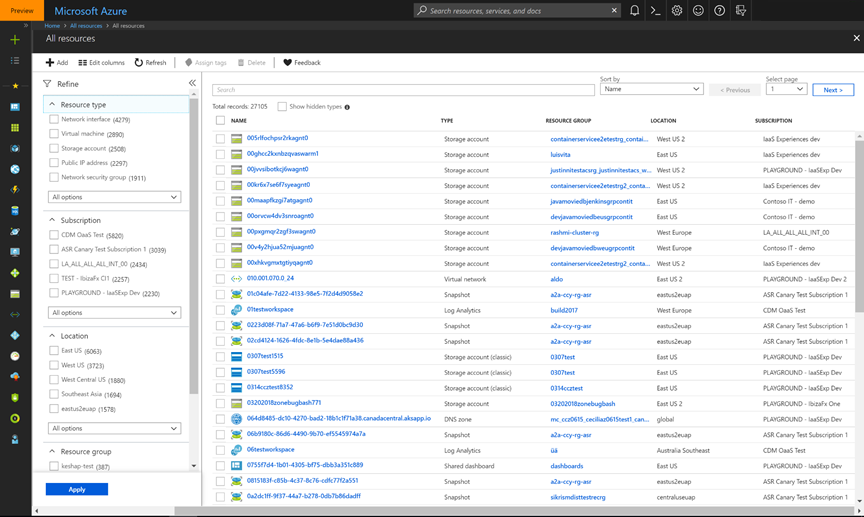
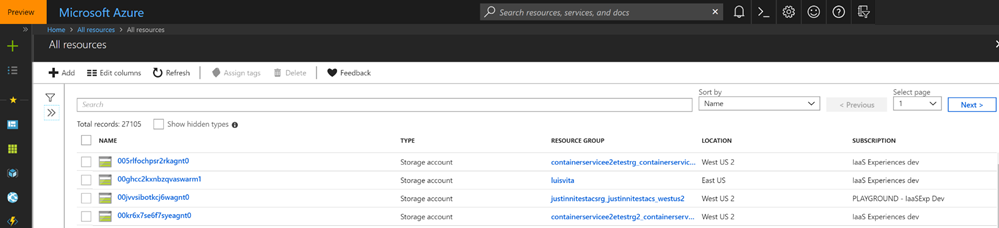
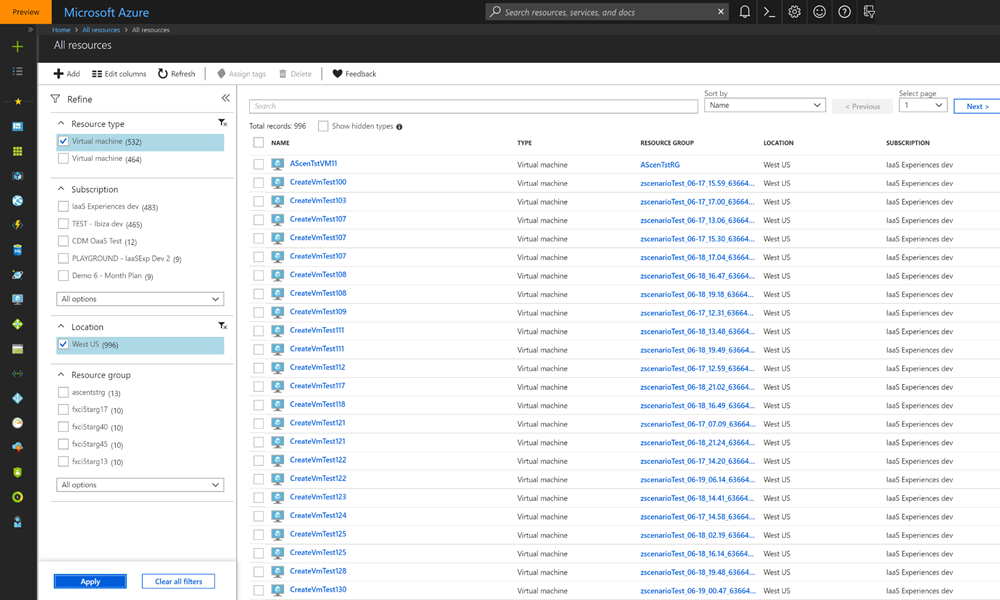
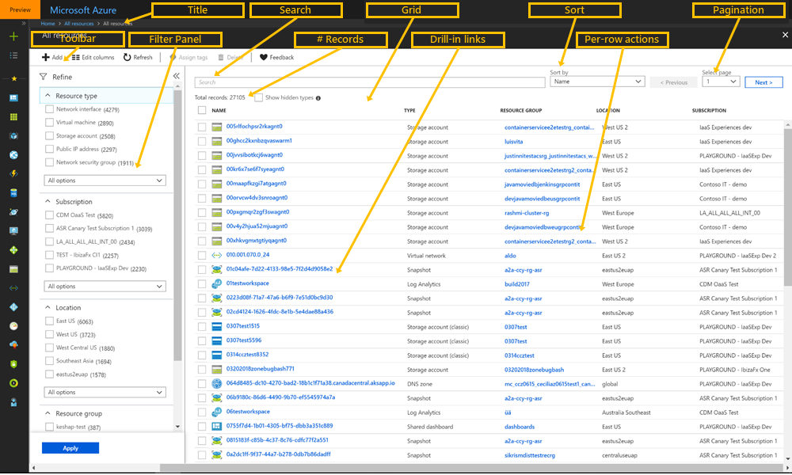
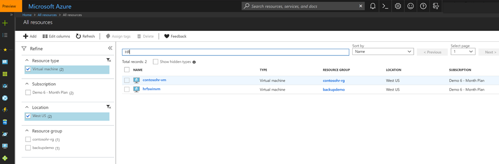
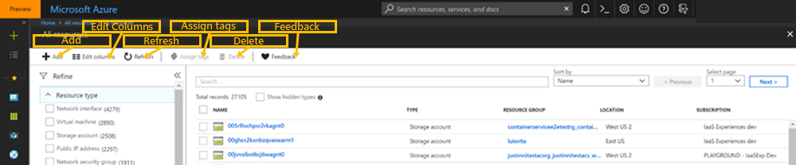
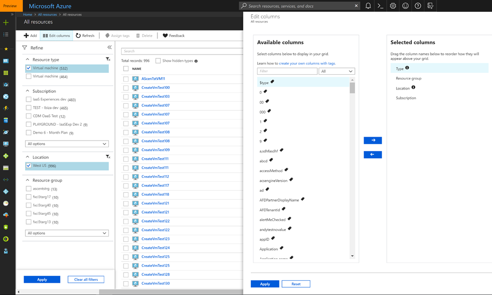
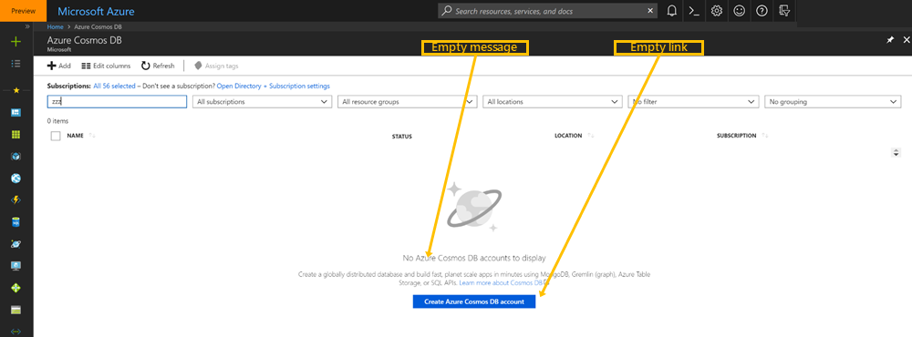

## Overview

The Resource Browse pattern provides resource discovery and management across resource groups. It allows users to view lists of resources of a single resource type, or multiple resource types, across regions, locations, and subscriptions.  The resource browse page, or the Browse blade, is typically the entry point into an Azure service.

The `All resources` service, as in the following example, is one of the most used services because it enables you to browse across all Azure resource types in a single list.  
  

  
Resource browse provides easy filtering, searching, sorting and grouping within the list.  The user can perform bulk actions to take action on selected resources directly from the list.  Selecting a resource from the browse experience will invoke the Resource Manage experience.

Some examples are as follows.

* All Resources for the RC portal are located at   [http://aka.ms/portalfx/allRCResources](http://aka.ms/portalfx/allRCResources)

* All Virtual Machines for the RC portal are located at  [http://aka.ms/portalfx/allRCVirtualMachines](http://aka.ms/portalfx/allRCVirtualMachines)

Resource facets can be collapsed, as in the following example, to allow more space for columns in the resource grid.

 Resources can also be filtered, so that only the ones most relevant to the current task are displayed. In the following image, resources are filtered by resource type and by location.
 

The Azure Fundamentals report located at  will report on . for your resources. This includes .

## Browse behaviors

The Resource Browse is a fullscreen experience, as in the following image.
 

The key items that are displayed are as follows.

* Title

    The title is typically a descriptive plural noun that reflects the items in the grid.  It does not change to reflect any filtering, searching or sorting. Some examples are: `All resources`, `Virtual machines`, and `Storage accounts`. 

    Remember to include the display name, including singular and plural forms, in addition to uppercase and lowercase variants for the resource, as specified in [portalfx-extensions-assets.md#define-the-asset-type](portalfx-extensions-assets.md#define-the-asset-type). Also remember to define keywords for the asset so that the service will be more discoverable.
    
    For more information about display names for resources, see [portalfx-browse-migration.md#migration-process](portalfx-browse-migration.md#migration-process).

* Toolbar

    The toolbar contains actions that operate against the grid. For more information, see [#the-toolbar](#the-toolbar).
    
* Filter panel

    The filter panel contains a list of properties that are common across all the resource types displayed in the grid. 

    <!-- TODO: Locate SDK reference for how the set of properties in the filter panel are specified  -->

    **NOTE**: Remember to include key filters for specified resource types.

* Grid

    By default, no-code Browse displays the resource name, resource group, location and subscription.  However, you can choose other key resource properties to display as columns, so that your customer can differentiate the resources in the grid.  Default columns and available columns can be added to a `ViewModel` programmatically, as specified in [top-extensions-browse.md#customize-columns](top-extensions-browse.md#customize-columns).
    
    For more information about the grid, see [#the-grid](#the-grid). For more information about no-code browse, see [top-extensions-browse.md#building-browse-experiences](top-extensions-browse.md#building-browse-experiences). 

    **NOTE**: Typical columns that are included in a grid are resource name, location, and subscription.
    
    * Search

    The following image displays a search of grid items in a filtered list. The search is for string  "HR".

    

    * Sort
    
        Handled by the grid

    * Pagination
    
        Displays the selected page and handles previous and next page navigation in the grid, based on the number of rows in the filter and the number of rows in the display. 

    * Number of records

        Displays the record set being displayed and the total number of resources.

    * Drill-in links

        Deep-link to the resource type for the specified resource.

    * Per-row actions

        Actions can be added on a per-row basis using context menu commands as specified in [top-extensions-browse.md#add-context-menu-commands](top-extensions-browse.md#add-context-menu-commands).

### The toolbar

The toolbar allows the user to add and delete resources from the grid, in addition to performing resource-specific actions for a limited set of resource types. An annotated toolbar is in the following image.
    

The recommended actions for the toolbar are as follows.

* Add

    Invokes the Resource Create experience for the resource types displayed in the "new" resource blade. Uses the `Add command` SDK as specified in [top-extensions-browse.md#the-add-command](top-extensions-browse.md#the-add-command).

* Edit columns

    Change the columns in the grid. An example is in the following image.

    

    **NOTE**: Remember to include key columns for specified resource types. Do not offer a Resource Browse experience that does not contain any resource-specific properties.

* Refresh

    Repopulate the grid with fresh data
    
* Assign tags

    Assign tags to the selected grid items.  The option is disabled until grid items are selected.

* Delete

    Delete the selected grid items.  The option is disabled until grid items are selected.

* Feedback
    
    Allows users to give feedback about the Azure Portal Resource Browse experience.

## Creating a resource or resource type

The following image is of an empty resource type that was selected from the Resource Menu, or the left navigation bar. 

You can customize the content and links when the resource or resource type is empty. When the Resource Browse experience contains no items,  it  displays a customized message that explains the value and usage of the resource types, in addition to help links that will provide more information.  The icon, message and link are located in the definition of the asset, as specified in [portalfx-extensions-assets.md](portalfx-extensions-assets.md). Some sample definitions are as follows.

* AssetType icon 

    `Icon="{Resource CommonImages.snowmobile, Module=V1/ResourceTypes/Common/CommonLogos}"`

* AssetType description 

    `Description="{Resource AssetTypeNames.Snowmobile.description, Module=ClientResources}"`

* AssetType link

    `<Link Title="{Resource AssetTypeNames.Snowmobile.linkTitle, Module=ClientResources}" Uri="http://www.bing.com"/>`

**NOTE**: Remember to include an empty message and a link with which to explain the value of the new resource.

## Designing for resource browse

### Design tools and toolkits

The Azure Portal team has published design toolkits so that it is easy for you to wireframe your solution to look like the Azure portal. There are also other tools available for rapid prototyping of user interfaces.

<!-- TODO: Determine whether we can include links to competitor websites, like Adobe and Figma. -->
The following toolkits are available
| Toolkit | Location |
| ------- | -------- |
| Adobe Illustrator | |
| Adobe XD | |
| Figma | |
| Powerpoint | [http://aka.ms/portalfx/powerpoint-toolkit](http://aka.ms/portalfx/powerpoint-toolkit) |
| Sketch | [http://aka.ms/portalfx/sketch](http://aka.ms/portalfx/sketch) |

### Icons

For more information about icons, see [top-extensions-style-guide.md#iconography](top-extensions-style-guide.md#iconography).
