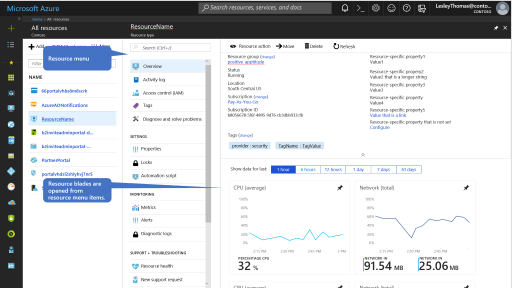
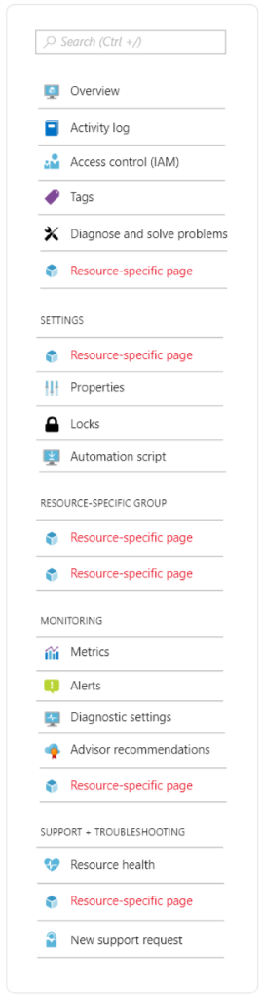

# Resource Management

## Overview
 
The Resource Detail pattern provides the configuration and management of a single Azure resource. It is also known as: 

* Resource blade 

* Resource detail 
 
The following Azure resources are good examples of this design pattern.

* Redis cache 

* Virtual Machines 

## Usage guidance 

The Resource Detail pattern is used to configure and manage ARM resources in Azure.  The resource detail page is typically opened from a Resource Browse experience where the user is seeing a list of resources and needs to see more details or make a change to a specific resource. 

## Screenshots 
 
The resource detail pattern is a full screen experience composed of a resource menu and corresponding resource blades.  
      

## Getting started with resources 

The following steps describe how to create a resource in Azure.

1. Build an Overview page, which serves as the home page for the resource.

1. Enable the right flags to show common items.

1. Add resource-specific pages in common groups as necessary.

1. SEO your menu to help the user find items using search, as specified in .

## Resource Behavior 

* Overview page
 
    The overview page is the landing page for a resource. It provides customers with key information about the feature, thus saving them clicks and time by not always having them drill deeper. 

* Resource menu  
	
	The resource menu surfaces all pages related to that resource. 
	 
	The navigation bar includes pages that are common to all resources throughout the portal. Your resource will get those as a part of your subscription,  but some will require onboarding by the resource provider. [Learn more](top-blades-resourcemenublade.md) 
	 
	You can add as many pages to your resource as you like. Make sure each new page is grouped properly, as in the following image.
	      
    
	
	 [Learn more](top-blades-resourcemenublade.md#add-menu-items-to-the-menu)
	 
* Resource pages  

	Each menu item opens a page that allows the user to drill deeper for more information. 
	 
	Monitoring pages requires additional onboarding to Geneva, as specified in [https://jarvis-west.dc.ad.msft.net/53731DA4](https://jarvis-west.dc.ad.msft.net/53731DA4). 
	 
	Resource health requires additional onboarding to the resource provider (RP), as specified in [top-extensions-onboarding-with-related-teams.md#onboard-with-related-teams](top-extensions-onboarding-with-related-teams.md#onboard-with-related-teams). 
  
### Toolbar 

Toolbar commands should open context panes instead of narrow blades to avoid horizontal scrolling. Learn more [portalfx-controls-toolbar.md](portalfx-controls-toolbar.md) and [top-extensions-context-panes.md](top-extensions-context-panes.md).
 
### Essentials panel 

The essentials panel surfaces properties that are common throughout all Azure resources as well as important resource specific properties. User feedback has shown us that our customers rely heavily on the essentials panel for looking up information. Learn more [portalfx-essentials.md](portalfx-essentials.md) and [portalfx-controls-essentials.md](portalfx-controls-essentials.md).

## Page Content

* *Must* meet the performance bar – the overview page is the most viewed blade for your resource  

* Content to guide the user to get the most from the resource 

* Resource properties to indicate important resource configuration
 
* Resource performance metric graphs to indicate whether resource is functioning properly 
 
| Do | Don't |
| -- | ----- |
| Enable the recommended flags on your Resources  | Don’t create resource-specific menu groups that have only one menu item  |
| Enable tags (includeTags:true) on the essentials panel   | Don’t put so much information on your resource overview page that it fails the performance bar. You'll end up removing it to meet the bar.    | 
| Open context blades for user input and short summaries   |  Don’t build your overview page as a PDL blade | 
| Ensure you have efficient APIs to get data for your overview page   |   | 
| Build your overview page as a template blade   |   | 
| Assign keywords to your Resource Menu items to help the user find items   |   | 
| Drive your RP teams to onboard to monitoring and resource health services  |    | 
| Drive your RP teams to onboard for health and troubleshooting   |   | 
| Do leverage a status bar for resource level or page level messaging (error, warning, info, upsell)  |   | 
 
## For developers 
 
* Make your resource menu static to meet the performance bar 

* Make sure you have efficient APIs for overview data 

* Make sure your RP has onboarded to Geneva for metrics and logs so you can enable the monitoring menu items 

* Make sure your RP has onboarded to health services so you can enable the diagnose/troubleshooting and resource health menu items 

* To display tags in the Essentials Panel, add this line to the options object passed to the essentials control:  includeTags:true 

 
## Related Ibiza SDK Documentation 

This is a list of related Azure Portal Ibiza SDK documentation that is not referenced in this pattern. 

Properties blade 	https://github.com/Azure/portaldocs/blob/f3a637fd8f117901d120f8d96c51892f8954a8bf/portal-sdk/generated/portalfx-blades.md#introduction-to-blade-kinds-properties-blade  

 
Related patterns 
Resource Management 
Resource Browse 
Fullscreen 
Forms 
 
Next steps 
	1. Pin to dashboard from Resource Overview – what happens via framework and what is resource responsibility 
(from Kristian Nese)   
		I notice that there’s seems to be quite random in terms of which resources we actually can pin to a dashboard – vs resources that doesn’t show anything at all. 
				Eventually, this all boils down to an inconsistent and bad customer experience, as there’s a lot of randomness (apparently) in terms of what can be placed on an Azure dashboard.  
				To that end; I was wondering how we best can raise and track this moving forward? Since this applies to all of our Azure services and likely most of our resource types, would this fit into Azure fundamentals? 
		 
		Example here is ASC, that shows up like this: 
		
		 
		 
		In comparison to something that work as expected, the Azure metrics preview shows its logo: 
		
		 
		 
		Last but not least, some pinned resources are simply not working. I can click on them as much as I want – but nothing happens. 
		Example here is VSTS Account: 
		
		 

