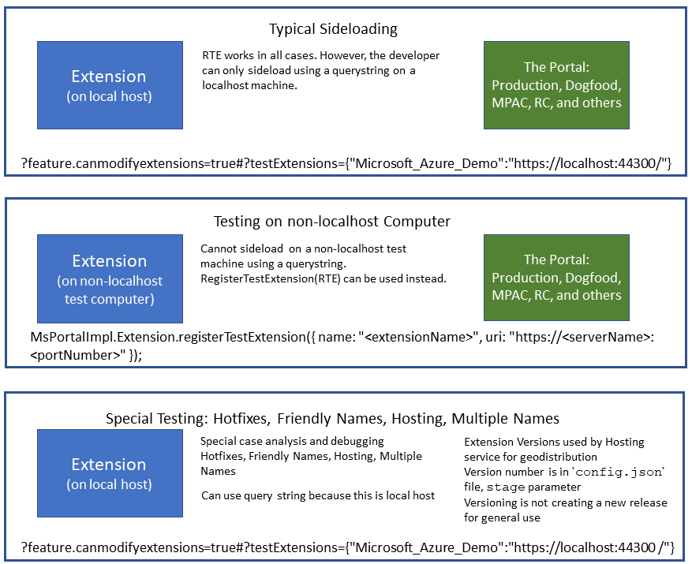

# Sideloading an Extension 

## Overview
   
Sideloading allows the testing and debugging of extensions locally against any environment. When unit-testing the extension, the developer can instruct the Portal to load the extension for a specific user session from any source other than the `uri` that is registered in the Portal. During standard Portal use, the Portal web application loads the extension from a URL that is part of the Portal's configuration, as specified in the environment configuration file(s) for the extension. Sideloading helps the developer validate that the extension is ready for standard Portal use in private preview or public preview mode. Sideloading allows the developer to include hotfixes, customize the extension for different environments, or test a new extension.  It can also be used to test an existing extension on a developer's machine with production credentials, in addition to private preview and some forms of usability testing.

Extensions can be loaded on a per-user basis on production deployments.  The different types of deployment for testing are in the following image.



Sideloading is useful when testing multiple versions of an extension, or determining which features should remain in various editions of an extension. For example, an English-language extension may have other UX editions that include localization for various languages, each of which may ship separately when the extension is deployed or geodistributed. The sideloaded extension can be loaded using a query string, or it can be loaded programmatically with the `registerTestExtension` method, which is the preferred method of testing.

Sideloading is performed on the local host by using [query strings](#query-strings), or it can be performed in any environment by [registering with the registerTestExtension API](#registering-with-the-registertestextension-api).

For more information about extension and Portal architecture, see [top-extensions-architecture.md](top-extensions-architecture.md).

For more information about testing extensions in the hosting service, see  [top-extensions-hosting-service-scenarios.md#sideloading](top-extensions-hosting-service-scenarios.md#sideloading). 

* * *

### Query strings

The main difference between sideloading and testing in production is whether the test can use a query string. The query string can only be used if the extension is on the localhost. There are also special types of testing like hotfixes or working with multiple names or friendly names while hosting.

The following is the syntax of a query string that can be used to load an extension by using the address bar in the browser.

```<protocol>://<environment>/?feature.canmodifyextensions=true#?testExtensions={"<extensionName>":"<protocol>://<endpoint>:<portNumber>"[,<settings>]}```

or 

```<protocol>://<environment>/?feature.canmodifyextensions=true#?testExtensions={"<extensionName>":"<protocol>://<uri>/"}```

where

**protocol**: Matches the protocol of the shell into which the extension is loaded, without the angle brackets.  It can have a value of `HTTPS`.  If the value is not  `HTTPS`, the browser will not allow the extension to communicate and the extension will not sideload.  If you have not trusted the certificate that **IIS Express** uses for localhost, the extension will fail to side load. For more information, see [portalfx-extensions-faq-sideloading.md#extension-will-not-sideload](portalfx-extensions-faq-sideloading.md#extension-will-not-sideload).

**environment**: Portal environment in which to load the extension. Portal environments are `portal.azure.com`, `rc.portal.azure.com`, `mpac.portal.azure.com`, and `df.onecloud.azure-test.net`.

**feature.canmodifyextensions**: Required to support loading untrusted extensions for security purposes.  This feature flag grants permission to the Portal to load extensions from URLs other than the ones that are typically used by customers.  It triggers an additional Portal UI that indicates that the Portal is running with untrusted extensions. This feature flag has a value of `true`.  For more information about feature flags, see [top-extensions-flags.md](top-extensions-flags.md).

**testExtensions**: Contains the name of the extension, and the environment in which the extension is located. It specifies the intent to load the extension `<extensionName>` from the `localhost:<portNumber>` into the current session of the Portal.

**extensionName**: Matches the name of the extension, without the angle brackets, as specified in the `<Extension>` element  in the  `extension.pdl` file.  For more information about the configuration file, see [portalfx-extensions-configuration-overview.md](portalfx-extensions-configuration-overview.md).

**endpoint**: The localhost, or the computer on which the extension is being developed. The endpoint, or the computer that is being used for testing the extension. The extension endpoint when using a host other than `localhost` may also be the server where the extension will be hosted.

**settings**: Optional. Boolean value that registers the extension in the Portal for a specific timeframe. A value of `true` means that the registered extension will run only for the current browser session.  A value of `false` means that the registered extension is valid across browser sessions. This state is saved in the browser's local storage. The default value is `false`.

**uri**: Defines the extension endpoint. If there is a port number associated with the extension, it can be appended to the `uri` by separating it from the `uri` by a colon. The uri is formatted as  `"https://<serverName>:<portNumber>"`, where 

**serverName**: The server where the extension will be hosted.

**portNumber**: The port number wher the extension is hosted on the endpoint that serves the extension, as in the following example: ```https://DemoServer:59344/```. 

The following complete URL and query string was built using the previous syntax.  It can be used to sideload the extension named "Microsoft_Azure_Demo" onto the localhost for testing. It also instructs the Portal to load from port 44300". It registers the extension only for the current user session.  

```?feature.canmodifyextensions=true#?testExtensions={"Microsoft_Azure_Demo":"https://localhost:44300/",true}```

### Registering with the registerTestExtension API

Registering an extension with the registerTestExtension API works in all cases. However, an extension can only be sideloaded using a query string on a localhost machine.

The developer may want to programmatically register a deployed extension with JavaScript and then reload the Portal. This step is optional. Using the `registerTestExtension` API for programmatic changes allows the developer to register an extension from `localhost`, or register an extension from a custom environment. 

Custom extensions that are used for testing can be loaded into the Portal by using feature flags. The `uriFormat` parameter, in conjunction with the `uri` parameter, can increase the number of extension editions that can be loaded in various Portal environments. These parameters are located in the `extensions.<EnvironmentName>.json` file, in conjunction with the `Client\extension.pdl` file. The edition of the extension that is loaded can be changed by modifying the `uri` and `uriFormat` parameters instead of using  **endpoint** and **portNumber** in the query string. 

To load an extension, extension developers can leverage the following approach.

<!-- TODO: Determine whether the registerTestExtension API can be used with the hosting service . If the registerTestExtension API allows use of a hosting service, find the example code so that the following sentence can be  re-included into the document:
  or load an extension from a custom environment using a hosting service.
 -->

 1. Sign in to a production account at [https://portal.azure.com?feature.canmodifyextensions=true](https://portal.azure.com?feature.canmodifyextensions=true)

1. Click **F12** to open the Developer Tools in the browser
  
1. Run one of the following commands in the browser console to register a custom extension.

    ```ts
    // use this command if the changes should persist 
    //  until the user resets the settings or
    //  executes MsPortalImpl.Extension.unregisterTestExtension("<extensionName>")
    //
    MsPortalImpl.Extension.registerTestExtension({ 
      name: "<extensionName>", 
      uri: "<protocol>://<endpoint>:<portNumber>" }
    );
 
    // use this command if the extension should be registered 
    //   only for the current Portal load
    //
    MsPortalImpl.Extension.registerTestExtension({
      name: "<extensionName>",
      uri: "<protocol>://<endpoint>:<portNumber>" }, 
      <settings>);
    ```

where

1. Reload the portal by navigating to [https://portal.azure.com?feature.canmodifyextensions=true&clientOptimizations=false](https://portal.azure.com?feature.canmodifyextensions=true&clientOptimizations=false).

1. Select the registered extension from the dashboard. Use the following code snippet to load the extension programmatically and register it in User Settings.

  ```ts
    MsPortalImpl.Extension.registerTestExtension({ name: "<extensionName>", uri: "https://<serverName>:<portNumber>" });
  ```

  Or, use the following code to registers the extension only for the current browser session.

 ```ts
   MsPortalImpl.Extension.registerTestExtension({ name:  "<extensionName>", uri: "https://<serverName>:<portNumber>"}, true);
```

  The extension that was registered will be saved to User Settings, and will be available in future sessions. When the Portal is used in this mode, it displays a banner that indicates that the state of the configured extensions has been changed, as in the following image.

  

For information about debugging switches or feature flags, see  [top-extensions-flags.md](top-extensions-flags.md).

For information about regular debugging and testing, see [top-extensions-debugging.md](top-extensions-debugging.md). 

For more information on loading, see [top-extensions-csharp-test-framework.md#creating-the-test-project](top-extensions-csharp-test-framework.md#creating-the-test-project). 

## Unregistering test extensions

When testing is completed, the developer can run the `unregisterTestExtension` method in the Developer Tools Console to reset the user settings and unregister the extension, as in the following example.

```ts
  MsPortalImpl.Extension.unregisterTestExtension("<extensionName>");
```

## Completing the extension test

When all steps are complete, the developer can submit a pull request to enable the extension, as specified in [top-extensions-publishing.md](top-extensions-publishing.md). When the extension is enabled, users will be able to access it in all environments, as specified in [top-extensions-developmentPhases.md](top-extensions-developmentPhases.md).

## Common uses for custom extensions

There are several scenarios in which a developer might test various ideas for an extension by using  different editions. Three of them are as follows. 

1. Running automated tests

    Automated tests that run against a production environment should be marked as test/synthetic traffic. Use one of the following options to accomplish this.

   1. Add the `TestTraffic` phrase to the `userAgentString` field. Replace `TeamName` and `Component` in the following example with the appropriate values, without the angle brackets.

      ```TestTraffic-<TeamName>-<Component>  ```

   1. Set the query string parameter to `feature.UserType=test`.  This setting excludes test traffic from our reports.

1. Running regression tests

   Regression tests and build verification tests only verify that the new extension runs, without performing extensive code coverage checks. For example, they may be used to validate that interfaces connect, which is not the same as testing the validity of the data or processes that use the interface.  They may also exercise only specific functionality within the extension.
  
1. Obsolete script bundles

    If the extension uses deprecated features that have been moved to obsolete script bundles, then the ```obsoleteBundlesBitmask``` flag should be specified, as in the following example.

    ```
      MsPortalImpl.Extension.registerTestExtension({
          name: "extensionName",
          uri: "https://<endpoint>:<portNumber>",
          obsoleteBundlesBitmask: 1 // or the relevant value as appropriate.
      });
    ```

    The current list of obsoleted bundles is in the following table.

    | Definition file | Flag  |  Bundle description | 
    | ---             | ---   | --- |
    | Obsolete0.d.ts  | 1     | Parameter collector V1/V2 |
    | Obsolete1.d.ts  | 2     | CsmTopology control | 

    For example, if parameter collector V1/V2 is used, then the `obsoleteBundlesBitmask` flag should have a value of  1. If the extension uses both parameter collector V1/V2 and CsmTopology control, specify 3 (1 + 2).

    **NOTE**:  If the extension uses obsolete bundles, there may be a performance penalty when it is loaded.  Its performance can be  improved by migrating away from these dependencies, i.e. PCV1, PCV2 and  `CsmTopology` control. For more information about improving extension performance, see [portalfx-extensions-configuration-procedure.md#pcv1-and-pcv2-removal](portalfx-extensions-configuration-procedure.md#pcv1-and-pcv2-removal).

    For more information about obsolete bundles and obsolete script bundles, see [portalfx-extension-reference-obsolete-bundle.md](portalfx-extension-reference-obsolete-bundle.md).

{"gitdown": "include-file", "file": "../templates/portalfx-extensions-bp-sideloading.md"}

{"gitdown": "include-file", "file": "../templates/portalfx-extensions-faq-sideloading.md"}

{"gitdown": "include-file", "file": "../templates/portalfx-extensions-status-codes.md"}

{"gitdown": "include-file", "file": "../templates/portalfx-extensions-glossary-sideloading.md"}